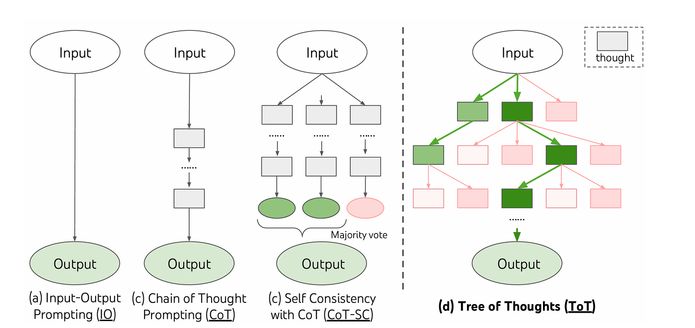
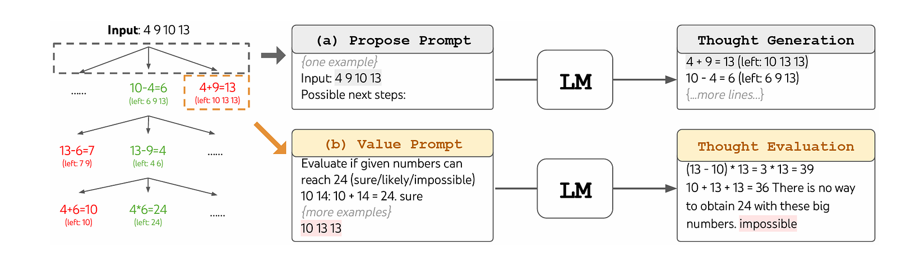

Wanting to learn more about LLMs, I stumbled upon a particular approach called Tree of Thoughts prompting or ToT. The idea seemed interesting, but also relatively straightforward to implement, and so I thought, why not code up something myself? Hence the post.

Now I spend < 2 hrs coding this up, and it involves little to no prompt engineering. So it doesn’t really solve the problem it was supposed to solve, but it does demonstrate the concept well enough.

#### What is ToT?



In normal IO Prompting, you take in a prompt & feed it into the LLM to get the output.

CoT is similar, but you ask the model to “think step by step”, so the LLM (hopefully) breaks down its output to different steps/thoughts to reason more explicitly and structurally about the problem. COT-SC is just running multiple CoT runs and then averaging out the result.

Now, these approaches have a problem; from the paper itself, two key shortcomings of existing approaches are: 1) Locally, they do not explore different possibilities at each state i.e. they don’t have the branches of the tree. 2) Globally, they do not incorporate any type of planning, lookahead, or backtracking to help evaluate these different options– the kind of heuristic-guided search that seems characteristic of human problem-solving.

Enter ToT, which allows LLMs to keep track of multiple thought paths in a tree of thoughts/states. It essentially is a tree search over states, where each state is an intermediate thought generated by an LLM, to solve the problem.

Anyway, we’ll get to it, once we go into the code, its much easier to understand from code.

But first, what’s the problem we’re trying to solve? Well…Game of 24

Game of 24 is a mathematical reasoning challenge, where the goal is to use 4 numbers and basic arithmetic operations (+-\*/) to obtain 24. For example, given input “4 9 10 13”, a solution output could be “(10- 4) \* (13- 9) = 24”.

Okay that’s the game, but we need an LLM for the task. I used the Llama-2–7b-chat model by Replicate — <https://replicate.com/meta/llama-2-7b-chat>, since I have no OpenAI credits lol.

```python
# Calls the LLM with the given prompt and returns the output
def run_llm(prompt):
    output = replicate.run(
        "meta/llama-2-7b-chat:13c3cdee13ee059ab779f0291d29054dab00a47dad8261375654de5540165fb0",
        input={"prompt": prompt, "max_new_tokens": 500, "temperature": 0.55, "top_p1": 1.0, "repetition_penalty": 1.0, "system_prompt": ""}
    )
    output_all = ""
    for item in output:
        output_all += item
    return output_all
```



Next, we need a “**thought generator**”, which takes a state and generates possible next steps from it.

For our game of 24, I used the below prompt, in which we first state the overall task. Then ask the LLM to generate possible next steps, also providing a few examples in context to make it a bit easier.

```
Your goal is to use the given numbers and the basic arithmetic operations 
(+, -, *, /) to obtain the number 24. You can use each number only once, 
but you can use the operations in any order and as many times as you want. 
This task will take multiple steps. 

For the current step, you choose two numbers and perform an arithmetic operation on them. 
Examples
Input: 4 9 10 13
Possible next steps:
Output1: 4 + 9 = 13 (left 10 13 13)
Output2: 10 - 4 = 6 (left: 6 9 13)
Output3: 10/9 = 1 (left: 4 1 13)
Output4: 9*13 = 117 (left: 4 10 117)

Input: 4 10 12 1
Possible next steps: 
Output1: 12 - 10 = 2 (left: 4 2 1)
Output2: 4 * 10 = 40 (left: 40 12 1)
Output3: 12 + 1 = 13 (left: 4 10 13)
Output4 12/10 = 1 (left: 4 1 1)

Now for the below input
Input: {state}

Possible next steps:
```

This will give an output like

```
Great, let's get started! For the input numbers 5, 10, 12, and 11, we have several options for how to proceed:

Output1: 10 - 5 = 5 (left: 10 12 11)
Output2: 12 / 5 = 2.4 (left: 10 12 11)
Output3: 11 + 5 = 16 (left: 10 12 16)
Output4: 12 *
```

We just want the part following “left:”, so I wrote a quick parser for that, which takes something like the above and gives us the next states in a nice list.

```python
# Parses the output of the proposal generator to extract the proposals
def extract_proposals(text):
    text = text.split("\n")

    text = [item for item in text if "Output" in item]

    proposals = []  
    for x in text:
        x = x.split("left:")
        if len(x) == 2 : 
            x = x[1][:-1]
            proposals.append(x)
    return proposals
```

Next, since this is a tree search, we’ll also need a heuristic to evaluate how good a particular state is. This is called the “**state evaluator”.** It takes in a state and gives it a numeric score of how “good” it is.

For the game of 24, we use the below prompt.

```
Evaluate if given numbers can reach 24 using basic arithmetic operations 
(+, -, *, /).You can use each number only once, 
but you can use the operations in any order and as many times as you want.

Some examples are:
Input: 10 14 -> 10 + 14 = 24. -> {Output: "sure"}
Input: 4 9 10 13 -> (10- 4) * (13- 9) = 24. -> {Output: "sure"}
Input: 20 10: Not possible -> {Output: "impossible"}

Can the numbers {INPUT} reach 24?
```

Since we are asking the model to output sure/impossible/likely, we need a parser to convert this text output to a decimal score

```python
# Parses the output of the state evaluator to extract the score
def extract_evaluation(text):
    text  = text.lower()
    if "impossible" in text:
        return 0
    elif "sure" in text:
        return 1
    else:
        return 0.5
```

So now we have all the required components for our tree search. We’ll be doing a BFS search with the following steps

1. Pass each state in the current set to the thought generator and generate proposals from it.
2. Each run through the thought generator generates multiple proposals, and we pass each state multiple times through the proposal generator and store all the proposals.
3. Evaluate all the proposals through our state evaluator, run each state through it multiple times, and average out the score.
4. Sort the proposals by the score, and take only the top K.
5. Repeat this until you run out of compute budget OR all your proposals have a crappy score.
6. Output the best proposal

```python
curr_states = ["5 10 12 11"]

TREE_DEPTH = 3 # number of steps to take 
PROPOSAL_RUNS_PER_STATE = 2 # number of calls to proposal generator per state, we concatenate the proposals from these runs
EVAL_RUNS_PER_STATE = 3 # number of calls to state evaluator per state, we average the score from these runs
BRANCH_FACTOR = 3 # number of top - k states to keep at each step

for _ in range(TREE_DEPTH):
    proposal_and_score = []
    # curr_states contains the best k states from the previous step OR the initial input state
    for state in curr_states:
        proposal_prompt = f"Your goal is to use the given numbers and the basic arithmetic operations (+, -, *, /) to obtain the number 24. You can use each number only once, but you can use the operations in any order and as many times as you want. This task will take multiple steps. For the current step, you choose two numbers and perform an arithmetic operation on them. \n\nExamples\nInput: 4 9 10 13\nPossible next steps:\nOutput1: 4 + 9 = 13 (left 10 13 13)\nOutput2: 10 - 4 = 6 (left: 6 9 13)\nOutput3: 10/9 = 1 (left: 4 1 13)\nOutput4: 9*13 = 117 (left: 4 10 117)\n\nInput: 4 10 12 1\nPossible next steps: \nOutput1: 12 - 10 = 2 (left: 4 2 1)\nOutput2: 4 * 10 = 40 (left: 40 12 1)\nOutput3: 12 + 1 = 13 (left: 4 10 13)\nOutput4 12/10 = 1 (left: 4 1 1)\n\nNow for the below input\nInput: {state}\nPossible next steps:"

        # generate proposals for each state
        proposals = []
        for _ in range(PROPOSAL_RUNS_PER_STATE):
            proposals += extract_proposals(run_llm(proposal_prompt))

        # get the score for each proposal
        for proposal in proposals:
            eval_prompt = "Evaluate if given numbers can reach 24 using basic arithmetic operations (+, -, *, /).You can use each number only once, but you can use the operations in any order and as many times as you want.\n\nSome examples are:\nInput: 10 14 -> 10 + 14 = 24. -> {Output: \"sure\"}\nInput: 4 9 10 13 -> (10- 4) * (13- 9) = 24. -> {Output: \"sure\"}\nInput: 20 10: Not possible -> {Output: \"impossible\"}\n\nCan the numbers" + proposal + "reach 24?"

            score = 0
            for _ in range(EVAL_RUNS_PER_STATE):
                score += extract_evaluation(run_llm(eval_prompt))
            
            proposal_and_score.append((proposal, score/3))
    
    # sort proposals by score
    proposal_and_score.sort(key=lambda x: x[1], reverse=True)
    # keep the top k proposals
    curr_states = [item[0] for item in proposal_and_score[:BRANCH_FACTOR]]

# print the best state
print(curr_states[0])
```

That’s mostly ToT in a nutshell, although a really, really minimal and totally not working implementation of it. You can find the source code here- [ayushtues/tot\_from\_scratch (github.com)](https://github.com/ayushtues/tot_from_scratch/blob/main/replicate_tot.py).

To enhance it, we can do the following.

1. Prompt Engineering to improve the proposal and evaluation prompts by a LOT
2. Multi-threading to run executions of different states in parallel
3. Other search methods like DFS/A\*
4. Making the code more clean/extendable by following OOPS — A very good clean implementation, with a lot more features, is <https://github.com/kyegomez/tree-of-thoughts>.

Anyway, this was just a small hack to learn more about LLMs, wasn’t really the aim to make it work perfectly, that's it for the post as well!

---

*Originally published on [Medium](https://medium.com/@ayushtues/a-hacky-minimal-tree-of-thoughts-implementation-47474934fa17).*
