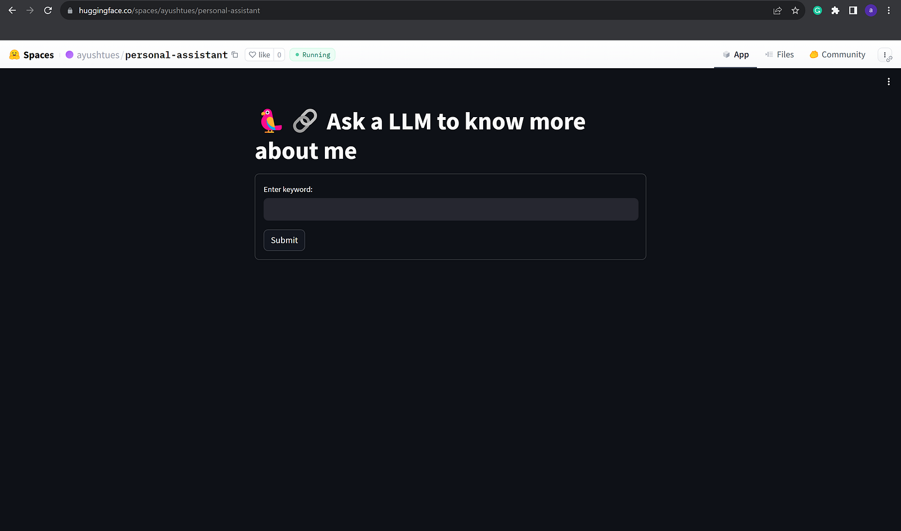

> Yes, I am doing an LLM post after cringing about the gazillions of the already existing ones, but it's my blog, so fuck it.

Having wanted to learn about LLMs for a while, what better way to do so than hacking away at something using them? And the ecosystem surrounding them has developed so rapidly that it was surprisingly easy to get something running *very, very* quickly.

I had a personal portfolio website hosted on Github, and while it is a good way to know more about me, it feels static ( cause well, Github only supports static pages), and I wanted to add something dynamic to it. Enter LLMs.

Here’s a quick preview of what I made; try it out on my website: [Ayush Mangal | Academic (ayushtues.github.io)](https://ayushtues.github.io/).



So I created a QA bot over my personal information, which anyone can talk to, to know more about me. Why anyone would want to do that is a different question, which is beyond the scope of this article.

Okay, so how did we do it? Simple

- Custom web scrapers in Python + Langchain to mine my personal information from various sources
- Langchain to create a QA bot over the data
- Replicate for the LLMs
- Huggingface for embeddings
- Streamlit for creating the webapp
- Huggingface spaces to host the web app for free
- Embedding the HF space iframe in my Github Website to make it dynamic!

Okay, wait, it doesn’t sound so simple now. Let’s break it down a bit, shall we?

### The data

Any LLM trained on general web data doesn’t know anything about me; I mean, I am not that famous, *yet. S*o we need to give the LLM information about me.

Currently, I feed the LLM the following data

#### **Transcripts from my YT channel**

I have a YT channel where I discuss various research papers I am interested in, and I thought it would be cool if the LLM knew about it.

Langchain has a nice YoutubeLoader tool to get all the transcripts from a YT video. So I only needed to get the video IDs for all the videos on my channel. There is an API from Google to do that, but I wrote a quick web scraper to get all the IDs from the YT page of my channel.

```python
from langchain.document_loaders import YoutubeLoader
import requests
import re

# some webscraping using requests and regex to get all IDs for my youtube videos
my_url = "https://www.youtube.com/@rrwithdeku8677/videos"
r = requests.get(my_url)
page = (r.text)
pattern = r'watch\?v=([^"]+)'
matches = re.findall(pattern, page, re.IGNORECASE)
ids = [x.split('=')[-1] for x in matches] # has all the IDs

base_url =  "https://www.youtube.com/watch?v="

video_data=  []

# Using YoutubeLoader from Langchain to get the transcripts of the videos
for id in ids:
    loader = YoutubeLoader.from_youtube_url(
        base_url + id, add_video_info=True
    )
    print("got loader")
    data = loader.load()
    video_data.extend(data)

# video_data has all the YT transcripts now from my YT channel
```

#### Medium Blog Posts + My Personal Website

I thought it might be a good idea to add all my medium posts as well. Again Langchain has a cool WebBaseLoader, which can extract the text from any webpage. So I just needed to get the links to all my blogs, which I did by writing a custom web scraper and Beautiful Soup.

I also thought since my personal website already has so much info about me, why not add that in the mix too?

```python
  from lxml import etree
  from langchain.document_loaders import WebBaseLoader
  from bs4 import BeautifulSoup

  def has_numbers(inputString):
    return any(char.isdigit() for char in inputString)

  # Get my profile page 
  profile_url = "https://ayushtues.medium.com"
  response = requests.get(profile_url)
  soup = BeautifulSoup(response.content, 'html.parser')
  
  # Get the links to all my recent medium blogs from my profile page
  links = []
  for link in soup.findAll('a'):
      x = link.get('href')
      if x.startswith('/')  and has_numbers(x) :
          links.append(link.get('href'))
  links = list(set(links))
  
  # has the links to all my Medium blogs
  links = [profile_url+ x.split('?source')[0] for x in links]
  
  # Adding my personal website into the mix as well
  links += ["https://ayushtues.github.io/"]
  
  # Use Langchain to get the data from the blog links
  loader = WebBaseLoader(links)
  data = loader.load()
  video_data.extend(data)
```

#### My Resume

The document that contains the most updated professional knowledge about me! An essential ingredient in the mix. Again, Langchain has a good PyPDFLoader for this.

```python
  
from langchain.document_loaders import PyPDFLoader

  # download my resume from a public url
  url = 'https://huggingface.co/spaces/ayushtues/personal-assistant/resolve/main/resume.pdf'
  r = requests.get(url, stream=True)

  with open('resume.pdf', 'wb') as fd:
      for chunk in r.iter_content(2000):
          fd.write(chunk)
  
  # Load using Langchain
  loader = PyPDFLoader("resume.pdf")
  pages = loader.load()
  video_data.extend(pages)
```

### Creating the QA bot

There are already a thousand tutorials on creating a QA bot using Langchain. I found the documentation on their website to be the easiest: [QA over Documents | 🦜️🔗 Langchain](https://python.langchain.com/docs/use_cases/question_answering/).



I covered loading in the previous steps. After that, I used the RecursiveCharacterTextSplitter from Langchain to split the documents into splits of size 100. This is done because the documents are huge and can’t be fed into the LLM as a whole, and instead, we work with chunks.

```python
from langchain.text_splitter import RecursiveCharacterTextSplitter  

text_splitter = RecursiveCharacterTextSplitter(chunk_size = 100, chunk_overlap = 0)
all_splits = text_splitter.split_documents(video_data)
```

Now to actually search over these docs, we need to embed them. Most tutorials use OpenAI embeddings, but I had exhausted mine, and they seem to have a got protection against fake numbers. So instead, I turned to a free open alternative, HuggingFace Embeddings, which uses Sentence Transformer.

```python
  model_name = "sentence-transformers/all-mpnet-base-v2"
  model_kwargs = {'device': 'cpu'}
  encode_kwargs = {'normalize_embeddings': False}
  hf = HuggingFaceEmbeddings(
      model_name=model_name,
      model_kwargs=model_kwargs,
      encode_kwargs=encode_kwargs
  )
```

Then we need to create a vector store to store these embeddings and efficiently search on them. I used FAISS for this.

```python
from langchain.vectorstores.base import VectorStoreRetriever
from langchain.vectorstores import FAISS 

vectorstore = FAISS.from_documents(documents=all_splits, embedding=hf)
retriever = VectorStoreRetriever(vectorstore=vectorstore)
```

Finally, we need an LLM to actually perform the QA. With OpenAI blocked, I turned to Replicate (<https://replicate.com/>). I used the Llamav2 chat model.

```python
from langchain.llms import Replicate
llm = Replicate(
    model="a16z-infra/llama13b-v2-chat:df7690f1994d94e96ad9d568eac121aecf50684a0b0963b25a41cc40061269e5",
    input={"temperature": 0.75, "max_length": 500, "top_p": 1},
)
```

An LLM needs a prompt to work on. I used the following prompt.

```python
  from langchain.prompts import PromptTemplate

  template = """Use the following pieces of context to answer the question at the end. 
  If you don't know the answer, just say that you don't know, don't try to make up an answer. 
  Use three sentences maximum and keep the answer as concise as possible. 
  Always say "thanks for asking!" at the end of the answer. 
  {context}
  Question: {question}
  Helpful Answer:"""
  QA_CHAIN_PROMPT = PromptTemplate.from_template(template)
```

With all the components of our bot ready, we create a RetrievalQA from Langchain.

```python
from langchain.chains import RetrievalQA  

qa_chain = RetrievalQA.from_chain_type(
      llm,
      retriever=retriever,
      chain_type_kwargs={"prompt": QA_CHAIN_PROMPT}
 )
```

### Creating a webapp — Streamlit

Now we have an LLM AMA bot ready. But we need a web app for someone actually to be able to use it. I used Streamlit for this, which has really great integration with Langchain to make it easy to create LLM web apps.

```python
import streamlit as st
import os

st.set_page_config(page_title="🦜🔗 Ask a LLM to know more about me")
# Set the title
st.title('🦜🔗 Ask a LLM to know more about me')

# Get my Replicate API secret
os.environ["REPLICATE_API_TOKEN"] = st.secrets["REPLICATE_API_TOKEN"]

def get_query_chain():
  # logic to get qa_chain
  return 

# Initialize the QA chain
query_chain = get_query_chain()

def generate_response(topic, query_chain):
  result = query_chain({"query": topic})
  return st.info(result['result'])

# Create a form for the user to enter the question and submit it to the LLM 
# when clicked on submit
with st.form('myform'):
  topic_text = st.text_input('Enter keyword:', '')
  submitted = st.form_submit_button('Submit')
  
  # generate the response from the LLM and display it
  if submitted :
    generate_response(topic_text, query_chain)
```

This creates a web app which you can run on your localhost. But well, only you can access it. Not everyone on the internet.

### Hosting the webapp using Huggingface spaces

Huggingface, being the wonderful company it is, allows you to host your custom Streamlit apps on their website for FREE. You can read how to create a streamlit space here: [Streamlit Spaces (huggingface.co)](https://huggingface.co/docs/hub/spaces-sdks-streamlit). But it’s extremely easy.

It creates a `app.py` where you need to put all your web app code.

Note that you need to specify all required libraries in a `requirements.txt` file so that the space knows what must be preinstalled.

You can find all code for my space here : [ayushtues/personal-assistant at main (huggingface.co)](https://huggingface.co/spaces/ayushtues/personal-assistant/tree/main).



To embed this app into my personal website, HF provides an iframe snippet, which I can directly put into the HTML of my website to embed the above space into my website!

```xml
<iframe
 src="https://ayushtues-personal-assistant.hf.space"
 frameborder="0"
 width="850"
 height="450"
></iframe>
```

So that is how I created an AMA bot and embedded into my static website. There are a lot of improvements to be done, some of them being

- Using a local LLM like GPT4ALL/PrivateGPT or something to remove the dependency on Replicate, since I will run out of quota there soon.
- Making the retrieval better, probably by making it hierarchical, based on the source
- Allowing for conversation using Chat features
- Reducing the latency
- Adding more data sources, like my Github, Spotify etc
- Better code structuring

Anyways, this was a fun learning hack to get a taste of making LLM-powered apps. Let’s see what all I can do with it as time goes!

---

*Originally published on [Medium](https://medium.com/@ayushtues/creating-an-ama-bot-for-my-personal-website-using-llms-5201a641deae).*
