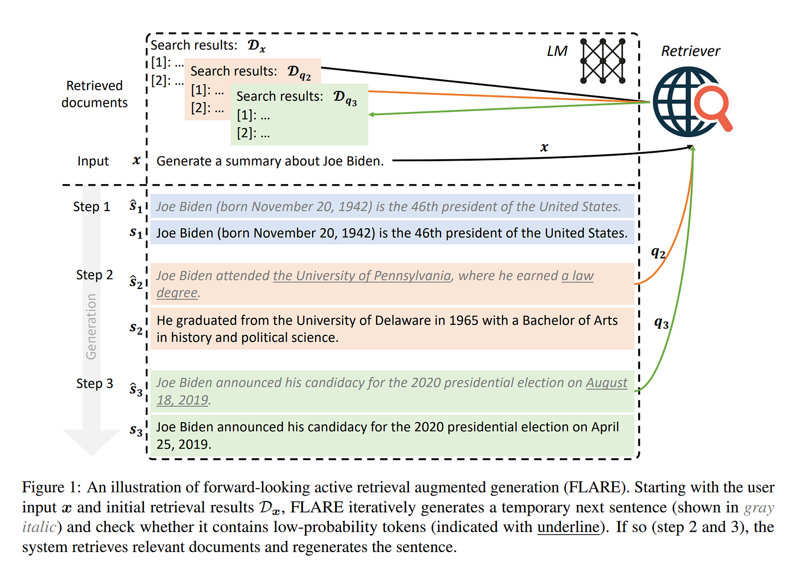

In an effort to learn more about LLMs, it was inevitable that I’d come across RAG (or Retrieval Augmented Generation). After watching a few online videos about different architectures for RAG and some advanced techniques, I was looking for something which I could implement.

Now, I can’t train any LLMs, limited by compute, but nonetheless, I found that there are some cool approaches which enhance RAG, while treating the LLM as a black box ( okay, maybe more like a grey box, more on this later). Enter FLARE or **F**orward **L**ooking **A**ctive **RE**trieval Augmented Generation (do they decide on the name first or the acronym nowadays?).

But we’re getting ahead; first things first, what the hell is RAG?

#### Retrieval Augmented Generation



There are a ton of resources on RAG, so I’ll keep it quick. So one of the problems with LLMs is that they only have information about the data they were trained on, cause well, duh, how would they know about anything that they were not shown during training?

Now, this creates a problem for use-cases where you want to use your LLM on different data. Maybe you want to know who won the latest FIFA match and want to query the internet for it, OR you want to connect your LLM to your personal Notion data to make your own personal assistant.

Basically, you want to **Augment your LLM with an external knowledge base**. So the idea goes something like this:

- You have a question or a *query,* and you have your knowledge base. You then **retrieve** relevant information for that query, from the knowledge base. This is usually done via embedding the query into a vector and doing some sort of nearest neighbours with your knowledge base, which might be a vector database, having all information represented by a vector.
- We then **augment** the query with the retrieved info, making the job easier for the LLM
- The LLM then **generates** the answer based on the augmented query.



#### Why FLARE?

Okay, so if RAG works, why do we need FLARE? The authors claim that most RAG pipelines currently, only invoke the retrieval step once, that is, using just the input. This works fine for short-form generation but is problematic for long-form generation, which needs complex information that is *not always evident from the input alone.* They claim that, similar to humans, gradually acquiring information about a topic in multiple steps, *long-form generation with LMs would require gathering multiple pieces of knowledge throughout the generation process.*

Following this, they ask the question — C*an we create a simple and generic retrieval augmented LM that actively decides when and what to retrieve throughout the generation process?*

Well, yes, and that is what FLARE does.



FLARE on a high level works as follows

- Deciding *when* to retrieve — They claim that LLMs should retrieve only when they are uncertain in their prediction. Assuming LLMs are well calibrated, meaning that the probability they predict, *is actually* how unsure they are about the prediction, they adopt an active retrieval strategy to retrieve only when the generated tokens have a low probability.
- *What* to retrieve — They say it is important to consider what LMs intend to generate in the future, as the goal of active retrieval is to benefit future generations. Therefore, they propose anticipating the future by generating a temporary next sentence, using it as a query to retrieve relevant documents, and then regenerating the next sentence conditioning on the retrieved documents.

That is it on a high level, I always find that things become clearer when you see the code, so let’s dive into a simple, minimal implementation of FLARE, ([ayushtues/FLARE\_from\_scratch: Implementing Forward-Looking Active REtrieval augmented generation (FLARE) from scratch (github.com)](https://github.com/ayushtues/FLARE_from_scratch)).

#### The vector DB

First, we’ll create our Vector Database, which is the external knowledge source we want the LLM to know about. In my implementation, I am looking to load all the transcripts of the videos on my [YT channel](https://www.youtube.com/channel/UCGEWHZv8Gn10Lk56PzCeFMA) into the database.

Now, the transcripts are just a bunch of text files; how do we know what part of the text to use for our LLM? In an ideal scenario, we’ll just pass all the text to our LLM as context, but that doesn’t work, because a) LLM’s can handle limited context length b) It will be very expensive. So instead, we find out the most relevant chunk of text based on our query.

First, we split the text files into chunks of size 200 each, using RecursiveCharacterTextSplitter from Langchain. Now, we need to convert the plain text into something on which we can do a similarity search with our query. We use a sentence transformer for this.

I used FAISS as my vector index, which calculates the sentence embedding of all the chunks from the transcripts and stores it in a vector index, allowing for efficient search for most similar chunks given a query ( embedded using the same sentence transformer ).

Also, I cache the embeddings, to make stuff faster, using LocalFileStore and CacheBackedEmbeddings from Langchain.

```python
from langchain.document_loaders import DirectoryLoader
from langchain.text_splitter import RecursiveCharacterTextSplitter
from langchain.vectorstores import FAISS
from langchain.storage import (
    LocalFileStore,
)
from langchain.embeddings import CacheBackedEmbeddings, HuggingFaceEmbeddings
from transformers import T5Tokenizer, T5ForConditionalGeneration
import torch

# create a vector db from the transcripts
def create_vector_db():
    # we use sentence transformer to get the vector embeddings for the database
    model_name = "sentence-transformers/all-mpnet-base-v2"
    model_kwargs = {'device': 'cpu'}
    encode_kwargs = {'normalize_embeddings': False}
    hf = HuggingFaceEmbeddings(
        model_name=model_name,
        model_kwargs=model_kwargs,
        encode_kwargs=encode_kwargs
    )

    # load all the transcripts stored in the data folder
    loader = DirectoryLoader('data_test/', glob="**/*.txt", show_progress=True)
    docs = loader.load()
    text_splitter = RecursiveCharacterTextSplitter(chunk_size=200, chunk_overlap=0)
    documents = text_splitter.split_documents(docs)

    # cache the embeddings for faster loadup
    fs = LocalFileStore("./cache/")
    cached_embedder = CacheBackedEmbeddings.from_bytes_store(
        hf, fs, namespace="sentence"
    )

    # create the vector db
    db = FAISS.from_documents(documents, cached_embedder)
    return db
```

#### The LLM

While the authors use GPT 3.5, not wanting to spend any money, I instead resorted to using an Open-Source LLM, Flan-T5 from Google <https://huggingface.co/t5-large>.

We’ll also define our input question, to which we want the answer from our LLM. Note that the LLM doesn’t have knowledge about this, since it's not in its training data, and it will have to figure out how to use the external knowledge from the vector db to answer this question.

```python
# initialize the LLM and its tokenizer, we are using Flan T5 Large for this
tokenizer = T5Tokenizer.from_pretrained("google/flan-t5-large")
model = T5ForConditionalGeneration.from_pretrained("google/flan-t5-large")

# function to get the prediction and scores from the LLM, given a prompt
def get_prediction_and_scores(prompt):
    input_ids = tokenizer(prompt, return_tensors="pt").input_ids
    outputs =  model.generate(input_ids, output_scores=True, return_dict_in_generate=True, max_length=100)
    generated_sequence = outputs.sequences[0]

    # get the probability scores for each generated token
    transition_scores = torch.exp(model.compute_transition_scores(
        outputs.sequences, outputs.scores, normalize_logits=True
    )[0])
    return tokenizer.decode(generated_sequence), generated_sequence, transition_scores

# the input prompt for the LLM containing the question we want to ask
input_text = "Q: What are streaming LLMs in the context of Large Language Models? Give a brief overview of the paper.\nA:"
```

We also return the probability for each generated token, since that will come in use later when deciding about whether to do a retrieval step or not.

#### The FLARE step

```python
# keep generating tokens until we get a </s> token
while True:
    # get the prediction and scores from the LLM, given the input and all the tokens generated so far
    generated_sequence, tokens, scores = get_prediction_and_scores(input_text)
    # if any token is low in confidence, then do a RAG step
    if torch.min(scores) < 0.1:
        # extract all tokens with high confidence as query
        high_confidence_tokens = tokens[torch.where(scores > 0.1)]
        query = tokenizer.decode(high_confidence_tokens)
        # get the context from the vector db
        docs = db.similarity_search(query)
        context = "\n".join([doc.page_content for doc in docs])
        new_input_text = f"Given the below context:\n{context}\n\n Answer the following \n{input_text}\n"
        # get the prediction and scores from the LLM, given the new input
        generated_sequence, _, _ = get_prediction_and_scores(new_input_text)
        input_text = f"{input_text} {generated_sequence}"
        if "</s>" in input_text:
            break
        
    else:
        # if all tokens are high in confidence, then just add the generated tokens to the input
        input_text = f"{input_text} {generated_sequence}"
        if "</s>" in input_text:
            break
# print the final output
print("Final output:", input_text)
```

Going step by step

- We start with our input query, and give it to the LLM and get the answer from the LLM. ( In later steps, this will also contain all the stuff generated from the LLM yet)
- Now, if the probability of *any* token in the generated output is lower than a particular threshold. We trigger a RAG step. This is because the LLM is not confident about its answer and we want to augment it with extra context. If all tokens were high confidence, we take the output of the LLM as it is and repeat.
- For the RAG step, our query is all the tokens in the generated sequence, which have a high probability. We don’t take the tokens with low probability, since they can be noisy.
- We then get the closest chunks from our DB using a vector search, and append this to our input as context.
- We then again query the LLM, but this time with the additional context, and get our final generated sentence and append it to our input.

As a dry run from a sample input, we get the below response :

```
input_text: Q: What are streaming LLMs in the context of Large Language Models? Give a brief overview of the paper.

generated_sequence: <pad> The paper presents a new approach to streaming LLMs, based on the use of a Streaming LLM model.</s>

----RAG step----

query:  <pad>The paper presents a new approach to streaming LLMs, based on use of  Streaming LLM model.

new_input_text: Given the below context:
say that deploying LMS in streaming applications such as multi-round dialogue where long interactions are expected is is urgently needed but has some challenges so this approach is for streaming
say 4,000 tokens you don't want to stop after 4,000 tokens you want to keep on going on and on and that is called streaming uh so they develop an approach for it which enables llms which were trained
input the streaming llm but only summarize the concluding paragraphs which might not be very uh insightful so
infinite length inputs without sacrificing efficiency or performance and if you see here the left you have so this approach is also called streaming llm so without llm on the left without streaming

Answer the following 
Q: What are streaming LLMs in the context of Large Language Models? Give a brief overview of the paper.
A:

generated_sequence after RAG: <pad> The paper describes a streaming approach to large language models for multi-round dialogue where long interactions are expected.</s>
------------

Final output: Q: What are streaming LLMs in the context of Large Language Models? Give a brief overview of the paper.
A: <pad> The paper describes a streaming approach to large language models for multi-round dialogue where long interactions are expected.</s>
```

So there you have it, a minimal implementation of FLARE. There are A LOT of things which I have glossed over since this was just a quick hack I tried out. Some of them are

- Prompt Engineering for the specific tasks
- Attempting the different datasets/tasks in the original paper
- In the query generation, I used what they call the Masked sentences approach, but they also have another approach in which they use another LLM to help generate a query, for the low-confidence tokens.

Maybe we’ll do this sometime if I get time. That’s all for this post!

---

*Originally published on [Medium](https://medium.com/@ayushtues/flare-advanced-rag-implemented-from-scratch-07ca75c89800).*
