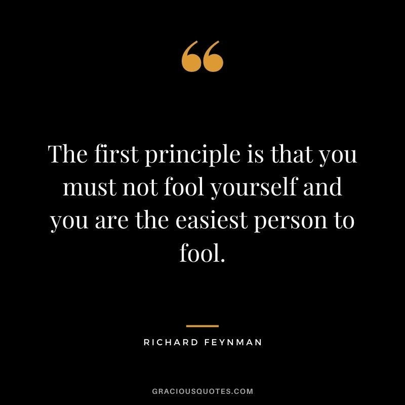
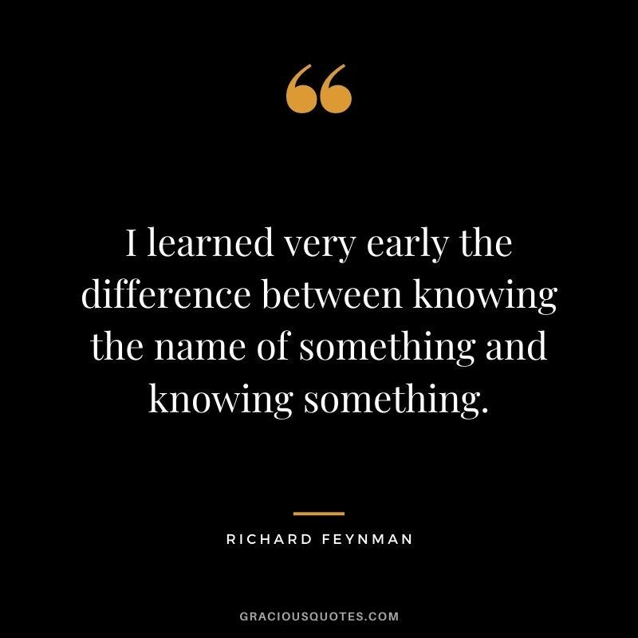

So a few days back I finished reading “Surely you are joking, Mr Feynman!”, the biography of Nobel prize-winning physicist Richard Feynman, best known for his contribution to theoretical quantum physics ( and less known for a whole lot of other stuff, like helping to create the atom bomb, having the patent for a lot of nuclear stuff, being an awesome painter, musician, an expert safe-lock picker and totally a ladies man xD ) and the author of what can be called the most popular physics book: The Feynman Lectures on Physics.

Now I have always been a lover of physics, or so I would like to say at least. It was my favourite subject in school, JEE, and it is probably because I used to spend a lot of time trying to go deep and understand stuff in physics during JEE, that I ended up becoming a research enthusiast in college ( although, not in physics though lol ). Anyway, since I had not really looked much into physics since college started, I thought it would be a good idea to read the Feynman book. I began reading the book with the expectation that it would have a lot of cool physics stuff, much like Hawking’s “A brief history of time” ( another book pretty high on my reading list ). But well, I couldn’t have been more wrong lol, there was very little physics in the book, with a few real-life examples here and there, but most of the book consisted of Feynman describing his day to day experiences ( actually the book I should have read was the Lectures book, but whatever lol). And I’ll be honest, I don’t know many genius people in history, but reading the book, I legit felt that Feynman was one of the smartest people I have ever read about ( kind of a similar feeling to reading Elon Musks’s bio ).

But I am not going to write the post about how I found him extremely intelligent ( that probably deserves a separate post ), but reading the book made me realise a thing I had forgotten about life.

Like any good physicist, Feynman was a follower of looking at things from “First Principles”. He always tried to *actually* understand stuff, way down from the basics. He didn’t try to skip any level of complexity as being “obvious”, and didn’t try to hide stuff in the name of using complex terms. All the examples he mentioned in the book were very very easy to follow, and you could actually understand what he was talking about, which is not a simple feat since he’s a guy of the likes of Newton and Einstein and easily one of the top-10 physicists of all time.

And it got me thinking, ever since entering into college, or even during my childhood, how often have I tried to *actually* understand things? The “getting shit done” attitude, often trades understanding for efficiency. And just like this tradeoff leads to the popular *technical debt* in tech, I think this habit has also lead to an *understanding debt* in my overall knowledge about stuff. Like I very often just understand stuff from a very bird’s eye view, and make myself believe that I know it, while in reality, my knowledge about it is full of holes.

And society promotes this kind of behaviour, from childhood we are conditioned to not ask too many questions. You are made to feel dumb for asking doubts, and our textbooks hardly explain stuff in detail, giving incomplete analogies about stuff( the book had a section about Feynman lamenting about the time when he was made to review the school textbooks of US ). A good example of this in the book was “energy”.

The textbooks introduced energy as — Energy keeps the wound-up toy moving, energy keeps the fan moving, energy allows you to pick up a stone. But isn’t this dumb? It’s just a definition of a word, I can replace Energy by X here and it doesn’t matter. I can say “LoremIpusum keeps the wound-up toy moving, LoremIpsum keeps the fan moving”. How is this actually supposed to teach you anything about energy?

More so in the tech world, there goes the saying that if stuff works, then it works. Don’t try to change it. People don’t understand why their own code is working half of the time. Nobody really understands how AI works anymore, not even the guys creating it. Is society really heading towards one where we use stuff *just because it works?* In college we are supposed to cover so many topics at once, that we hardly have time to actually understand any topic in detail, no wonder the research culture in India sucks.

Why are we so hell-bent on productivity? Why can’t we slow down a bit and actually try to understand stuff. Is there a reason why most of us feel like imposters? Is there a reason why we are always scared that people might find out that we don’t understand shit about what we are talking about. Is it okay for society to tell people that it’s OK that they don’t know what they are talking about? Is it ok to “move fast and break stuff”, instead of settling down and making stuff from small building blocks? Why do I have to feel guilty about trying to spend my time to understand the world in deep, and not spend my time “productively” on building flashy apps and products?

Well, that’s a lot of why’s, and a lot to understand about. But well, will you actually try to understand this, or just skip over? I am not sure about even myself, let anyone else, but well whatever, until the next one —

Stay Safe!

---

*Originally published on [Medium](https://medium.com/@ayushtues/how-often-do-we-try-to-actually-understand-stuff-170733c7436a).*
