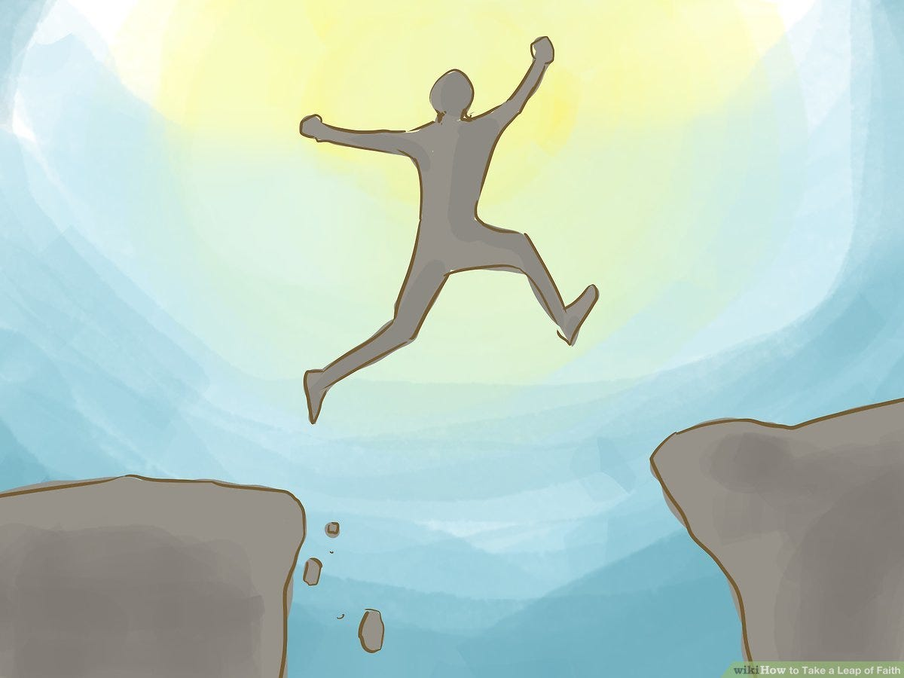

At this point, I feel like since no one actually reads this blog ( correction: no one I know reads this blog, each blog does actually get around 100 views usually on the internet ), I have started treating this more like a journal than anything. But if I do want to journal, then I should instead actually keep a private journal cause I can’t really say things openly here since it's public, but I am too lazy to actually start a journal; makes sense? Nopes, doesn’t to me, either.

Anyway, I just got back from my first trek (Kodachadri, Western Ghats) yesterday, well, not actually my first; I did go to Nishani Hills in Coorg last December, but compared to this trek, that was just a morning walk (albeit a really, really pretty morning walk lol). While the scenic beauty of the place was refreshing, it was the adventure and the oh-fuck-I-can-actually-die-if-I-am-not-careful moments in the trek which were the highlight for me.

While I don’t claim to be an adventure sports freak, I have been slowly trying to put myself out there to give them a shot whenever I get the chance, having attempted paragliding (Nainital), water rafting (Rishikesh), and recently even Bungee Jumping (Rishikesh) from ~100m. This is something which is new for me; I didn’t indulge in adventure sports before college cause a) I was totally dependent on my parents, who would never let me do something like this, and b) I wasn’t exactly the adventurous kind anyway growing up.

However, after trying some of these activities, I am starting to realize that I love adventure. I love the adrenaline rush you get when you know that you can actually die doing this. Every time I do something like this, at least for some time, I develop this hyper-realization of how fickle it all is and a sense that okay, whatever I have from now on is sort of a gift, which could have just been taken away from me, maybe that is what becoming grateful is? ( Although a hyper-privileged brat like me is *so-sooooooo* not actually grateful for anything in his life, but well :P ).

There is also a sense of giving up control while doing these activities, like Bungee Jumping, where you have to trust the operators with basically your life and just take a leap of faith, hoping that physics works and the rope doesn’t break or doesn’t break your spine or you don’t have a heart attack or whatever else can go wrong. It makes you realize that sometimes you just need to trust that things are going to work out and just go ahead with stuff ( or anyway, you’ll just die, and shit won’t matter to you; binary outputs are fun! ).

It also involves a certain amount of apathy towards your life to do stuff like this, which I feel I am totally capable of, being ready to die just for the sake of doing something fun, idk; it probably means that I am a repressed psychopathic adrenaline junkie who is trapped in a soul-sucking corporate job and sometimes needs a refresh from life, who knows?

Anyway, this was a shortie, that's all for the blog!

---

*Originally published on [Medium](https://medium.com/@ayushtues/leap-of-faith-6f8bb21fb10f).*
