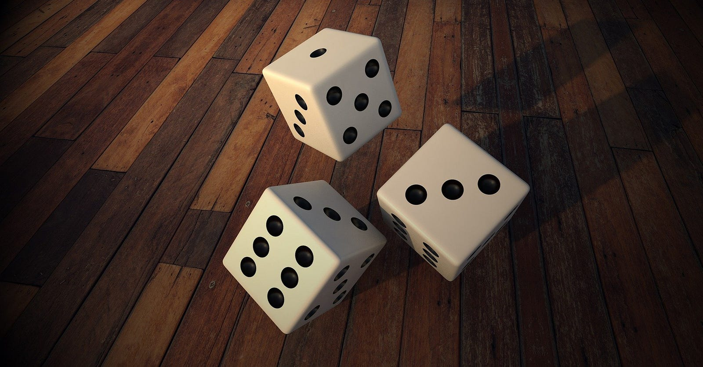

> This is another one of my “casual” posts, I usually write well-drafted blogs, but they kind of felt artificial, and something which I wrote for seeking validation from others in a sense, and not to express myself, so I thought I should drop that format and just go informal lol.

Is anything random? Or is the world deterministic? Well, even einstein was amused by this question, but let’s leave the correct answer to theoretical physicists ( or whoever does such type of research lol). Having an hour left before bed, and being bored out of hell from editing stuff for my research papers, I am here to edit even more stuff in my blog. ( Sometimes I think I should take up a job as a writer or editor somewhere since I spend more time writing/editing/reviewing stuff than actually doing CS stuff. )

Anyway, since the amount of “thoughts about life” in my mind start growing exponentially as bedtime approaches ( with a threshold at 2 AM after which it’s just hell ), I started wondering about the effect of serendipity ( a word I misspelt twice since I starting writing this article) in life. It kind of feels to me that all-important things in life happen randomly and there is actually not much we can do about the stuff that really has an impact on our life. So why do we try so hard to control things? Why not let the fates control our lives, is it really too lazy and non-virtuous to do so? ( you know the ancient greeks used to place the three fate sisters Clotho, Lachesis, Atropos above the all-powerful 12 Olympians like Zeus, Poseidon, Hades, with even the gods being subject to the dictates of fate )

Almost all good things ( and the bad things as well )in the last year I can think of happened randomly, well the entire year was a black-swan event anyway. I got connected to people almost randomly and out of nowhere ( btw, NEVER tell anyone that you just randomly texted them, if you haven’t talked in a while, you’ll get a nice backlash lol, people want to be felt important), all big professional achievements happened almost randomly, when I was not even trying hard, in fact, I have repeatedly observed that good things usually come to us when we are not looking for them, but that doesn’t make any sense right? If that’s the case, should we all relax and let fate play it’s cards and just deal with whatever hand we get? Is the concept of working hard to make our own destiny fundamentally flawed owing to the non-determinism inherent in the world?

Although the email ID handed to me by my college administration literally means “unlucky”, I personally believe that I have the devil’s luck at my disposal. I often take weird steps without thinking twice, leaving it to blind luck to make stuff work out for me, which it more than often does. And I don’t want to say this in a kind of bragging fashion, but my friends do now how much I rely on sheer dumb luck ( although I have kind of hidden this fact at college to hide my imposter syndrome, I was infamous in my school and coaching for my “tukkas” lol ). In fact, most good things happen when I let things go on autopilot. So does that make me an imposter? Or does that make me someone using statistics to his advantage? Well who knows, maybe when things go bad, it makes me an imposter relying on his luck, when things go good, it makes me lucky lol or maybe that’s just a self-serving contract.

Or maybe the randomness has something to do with the subconscious part of our brain. I have read somewhere that the best way to solve a problem is 1.) Do a lot of research about it 2.) Stop thinking about it completely, and try to do something as unrelated as possible 3.) Just wait for a eureka moment for the solution to automatically come to you ( and believe that this would happen ), and I think you would agree ( more than you would like to ), that this is how you get your best ideas, so maybe the creative process itself is random, or at least out of our conscious control?



Then is the life we are currently living just a result of random processes? And if so, does that reduce it’s worth, since it’s just one of the possible things that could have happened, and life could have gone any other way. Or does it increase it’s worth since we should be grateful that this is the one that came true and not the one where a meteorite or a nuclear war wiped everyone out? I personally find it a bit relaxing to have the burden of my future being slightly reduced from my shoulders and leaving somethings to fate, cause let’s face it, the world is a bit too complex for us to plan about. It’s a weird culmination of various complex dependencies between shit loads of random processes, and we are all but a tiny tiny part of it, with little to no actual control over it, for all the cosmos care, we are just random noise, that fades away when averaged out across people, planets, solar systems, galaxies and maybe even universes?

Then comes the all-powerful butterfly effect, where seemingly minor changes in the present, when compounded over time, lead to drastic changes in the future, while the effect is only observable in the past, like when you start considering that how that one seemingly mundane conversation changed your whole life, or how a guy’s taste for bat soup changed the world xD. If you take this effect seriously, then you can either be hyperconscious of all your choices, worrying that they’ll have a huge impact on your future, or just accept your inability to comprehend the subtle but powerful effects of compounding, and leave stuff to fate, and just be present.

Anyway, whether we like it or not, randomness rules our life more than we would like to accept, and hard work isn’t the only thing that matters, although relying on luck is itself not a good way to live life, so maybe we should try to find a good middle ground between them. But okay, I think I should sleep now, I’ll publish this tomorrow I guess, making sure I didn’t babble something weird at night ( which I do a lot ). Like always feel free to reach out to me if we haven’t talked in a while, cause you never know, maybe we are just one step away from a random conversation that changes our life?

Until then, Stay Safe!

---

*Originally published on [Medium](https://medium.com/@ayushtues/lets-talk-about-randomness-ec07993aa146).*
