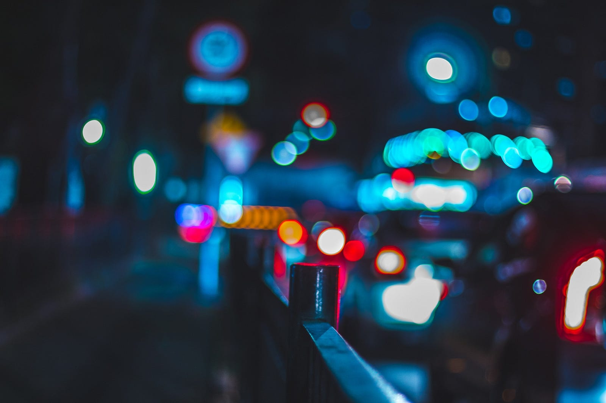

> Ahem, this is what a quarter life crisis feels like I guess :P

Aaaaaaaand I’m finally back in the mood to write again after so long, let’s see how this turns out, I don’t have a plan, I just feel like I should write something today, something, anything, just etch down what’s happening into something that’s permanently on the internet, a memory I can always come back to, with everything else in life passing away in a blur lol

A lot has happened in the last few months, a change of the magnitude of the initial lockdown days, or coming to college for the first time. I’ve graduated college, and moved into Hyderabad, a fucking huge city, completely uncharted and unknown to me (well sort of, I know it somewhat now lol). The last few months have been completely crazy, first the last 2 months in college were the most fun ones in my entire span of college life ( and probably like my life also lol ). I spent the entire time hanging around with my friends, or making new ones, walking around the campus till the night faded away, or going on random trips, or giving random chapos to juniors, it all seems like a blur now, I barely remember anything, and I also remember so much at the same time.

Then came moving into Hyderabad, while it has been 2 months since I came here, it feels like it’s been sooooooo long, and yet so less. Life’s become a routine, passing away in a blur, with going to work on the weekdays, and partying like hell, exploring the city on weekends, rinse and repeat. I’m meeting so many new and amazing people, holding on to the ones from college with all I have and also rekindling some relationships with a few older friendships. I’m trying out so many things, I went bowling, go-karting, played poker, monopoly, VR games which make you feel like a fucking Jedi for the first time, brushed up on my pool and foosball skills (finally get a bit better lol), picked up the guitar (again :P), its crazy how much life’s changed in such a short time really.

But with all the thrill of a new life, there’s also something that feels wrong at times. With things changing so fast, you can’t help but wonder what’s actually stable in your life, what’s constant, what’s something you know you can hold on to? The very definition of who you are changes so fast, you don’t know what you stand for, what things you like, what you don’t, who are the people you can call yours, who are just temporary visitors, here to fade away into a distant memory. You stop having control on your own time, not knowing what to do with it anymore, just doing whatever seems interesting, whatever makes you feel alive, passing away life in a blur. There’s something soulless about it, about going anywhere and everywhere without a goal, just hoping to reach somewhere, oh which reminds me of this nice quote from Alice in Wonderland

> **Alice:** Would you tell me, please, which way I ought to go from here?  
> **The Cheshire Cat:** That depends a good deal on where you want to get to.  
> **Alice**: I don’t much care where.  
> **The Cheshire Cat:** Then it doesn’t much matter which way you go.  
> **Alice:** …So long as I get somewhere.  
> **The Cheshire Cat:** Oh, you’re sure to do that, if only you walk long enough.

With so much instability in life, I feel it’s important to have some constants in life, to give some meaning to all the madness, something you can always return to, as something *you* do when you’re free, someone you know will be there for you, something that will always make you happy. For me I guess its just some people in my life, and some of my interests like music, reading, gaming or learning about random pointless stuff which has no practical use in my life lol. I guess these are the things that keep me sane, and give me some form of identity, making me, me. Oh this reminds me of another quote about how slowly things become a part of your life, from A Man Called Ove

> Loving someone is like moving into a house,” Sonja used to say. “At first you fall in love with all the new things, amazed every morning that all this belongs to you, as if fearing that someone would suddenly come rushing in through the door to explain that a terrible mistake had been made, you weren’t actually supposed to live in a wonderful place like this. Then over the years the walls become weathered, the wood splinters here and there, and you start to love that house not so much because of all its perfection, but rather for its imperfections. You get to know all the nooks and crannies. How to avoid getting the key caught in the lock when it’s cold outside. Which of the floorboards flex slightly when one steps on them or exactly how to open the wardrobe doors without them creaking. These are the little secrets that make it your home

I guess all this is normal, and expected when life’s going through a big change, and I shouldn’t think much about it, but well, what else are we supposed to do on a Sunday night, after the weekend passing by in a blur, partying lol. Let’s end it with a nice quote from the internet , and hope I keep on writing blogs regularly now lol

> The days blur into one, and the backs of my eyes hum with things I’ve never done.  
> - Radical Face

That’s all folks, Byeeeeeee!

---

*Originally published on [Medium](https://medium.com/@ayushtues/lifes-a-blur-ebf037874f37).*
