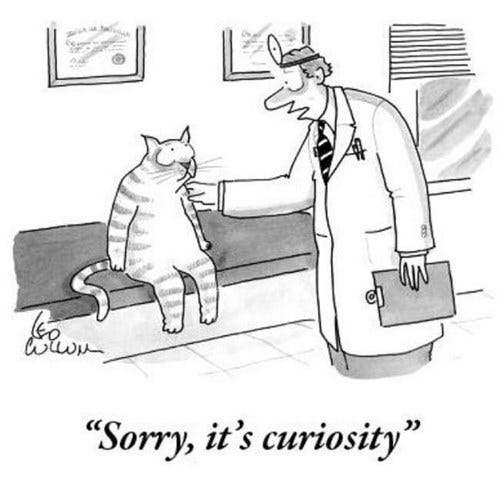
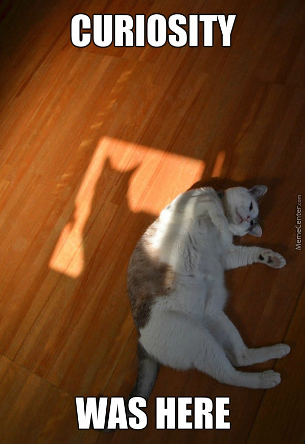
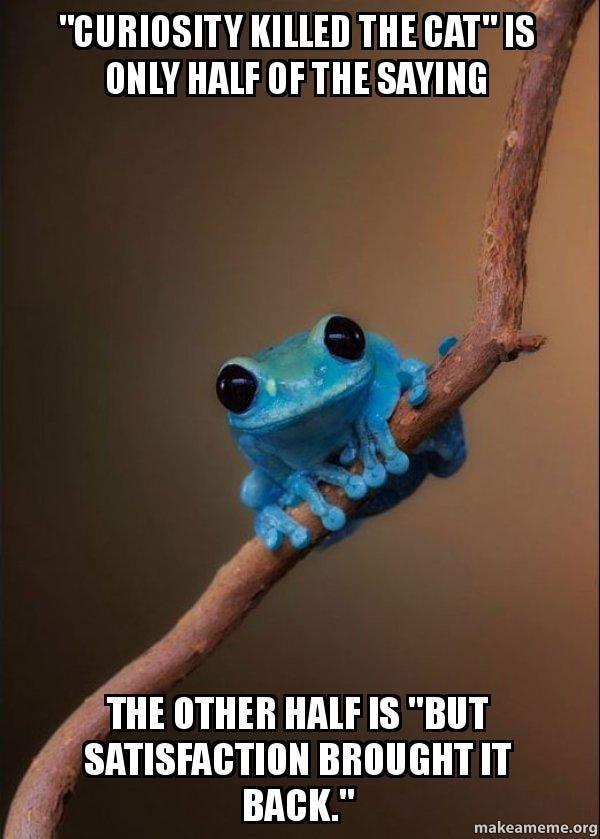
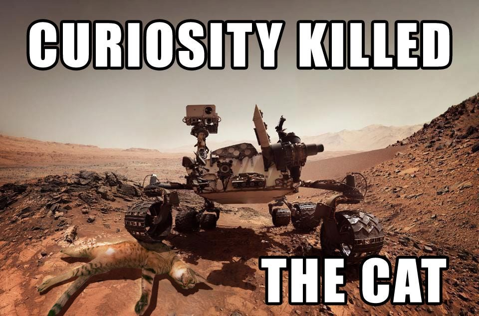

Curiosity killed the cat, but for some of us, it has been the only way to keep rolling through life in the last 2 years.



I was not a curious kid, and mostly spent my time playing video games all day (which you can read more about [here](https://ayushtues.medium.com/ah-shit-here-we-go-again-35dae2acf8c4) ), and rote-learning the answers teachers told us to memorise or practising the same questions enough time, to just learn the methods by heart. Well okay, my curiosity did start appearing through the cracks, while reading stuff about comic characters or the characters of the video-games on Wikipedia for hours, or while binge-watching stuff on History TV/Nat-Geo/Discovery all day long. ( Yep, I am a nerd, no point hiding it lol ).

And now, I basically live on curiosity, some days its the only thing that keeps me going on ( ah I sound so depressed lol, which is totally not the case btw). With the world locked in a pandemic, and having practically nothing to do for months at times, I could only depend on my curiosity to find any reason to get through the day. Reading books, watching podcasts, learning about cool new tech stuff, or useless philosophy, became the way to pass my time and my curiosity my only constant companion.

I am not sure what came first, whether my curiosity attracted me to research, or doing research made me more curious, but there is something deeply satisfying about losing yourself in the process of learning more about a topic you’re passionate about and finding yourself even more and more curious about it ( I am sooooooooo curious about the whole Crypto-Blockchain space right now, that I am diving deeper and deeper into the rabbit hole lol ).

And there’s this thing about curiosity, you don’t need any external incentive to pursue it, it’s just intrinsically rewarding to you. You will happily spend countless hours, satisfying it, while at the same time you’ll dream for a heft payment, for doing your job. In fact this intrinsic reward is such a powerful idea, that AI researchers have used “curiosity”, to train agents to learn complex behaviours without even having an external reward. The agent is just told to explore and do stuff which satisfies its curiosity, and in the process it learns these highly complex skills, which if you think about it, is true for humans too, when we allow ourselves to follow our curiosity, we can end up in places where we never imagined we’ll be capable of reaching 😛.

And now I feel there are just so many amazing things in the world, that I can’t imagine not being curious about it all the time. We’re living in an era where you can access any information you want with a simple google search, how can you not want to know more about stuff? And how the hell do you deal with the realisation that this small life of ours is not enough to satisfy our curiosity about really anything much, and how do you not want to try to learn anything and everything you can, while you still have the time? Lol for me this manifests in a weird way, where I sometimes ( read:often) put all my current responsibilities aside, and just start doing some shit reading for fun. Maybe that’s just a form of escapism, to avoid the work at hand, and instead get some instant intrinsic reward.

One place where curiosity really helps I think is in your relationships with others. I feel if you just try to be curious about the other person, as a wonderful human, full of interesting perspectives, worth knowing, you can never run out of things to talk about. If you’re truly curious about the other person, you will eventually start connecting them on a much deeper level, than you’d if you just do some small talk, cause like, who doesn’t like talking about themselves ( yep, we are all narcissists ). This is something I have personally benefited, well with nothing to do, and not being an interesting person myself, I have tried to be curious about other people ( trying to put it here in the most uncreepy way I can xD), and trying to know their views on things, which has been blissful.

I would have probably not survived the year without my curiosity, what else are you supposed to hold on to when you’re all alone, cut-off from society? It’s like music, its a constant in my life. Even if there is nothing else to rely upon, I can always rely on good music, or my curiosity to keep myself busy.

If curiosity is such an enriching thing for us, why do we try to suppress it? Why are we not encouraged to ask more questions? Why are people who ask more questions shunned off as nerds? Why do school teachers, who are supposed to educate us, lash off if we ask something out of syllabus? Hell, why are scientists shown as those crazy weird dudes and stereotyped? Most inventions we take for granted today, were the result of someone satisfying their curiosity, about what could be the limits of our society. I mean sure, curiosity did kill the cat, there are certain things were you just cant satisfy your curiosity, to bide by moral, ethical or societal rules, you can’t kill someone just cause you’re curious how it feels like ( no no, I am not a sociopath ), but apart from that, why are we forced to bottle in our curiosity?

Well whatever might be the reason for that, I for one can’t stop my curiosity, and I don’t want to really. It’s been a driving force for me, both professionally and personally, and has mostly lead to positive outcomes. If nothing, it just ends up giving you that extra motivational boost, you sometimes desperately need lol

Anyway, that was it for this post, with things coming back to normal, I am curious about how my life would be offline after so much time 😛

Until the next one, Goodbye!

---

*Originally published on [Medium](https://medium.com/@ayushtues/living-on-curiosity-f54ff980a947).*
