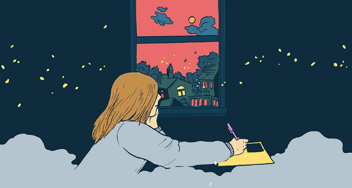

No, this is not a post about introverts or how introverts are some sort of a special species with zen-like superpowers to somehow led the world towards utopia.

This is me, on a trip to Kerela (Munnar-Thekkady-Alleypey, currently in Thekkady), with my family, sitting alone in the hotel room balcony, listening to songs, wanting to do a brain dump (read: rant) of random thoughts, while my family is out in the market, shopping (I for the life of me, never do random shopping lol).

I am someone, who likes to be alone, by myself. I purposely live alone, instead of sharing a flat with someone, even if it is more expensive, and sometimes, honestly a lot worse, logistically. I don’t have any social media, except Twitter and Linkedin (that too only for professional reasons). I barely message or call anyone, even my family (much to their dismay, I seriously believe they’ll someday disown me), usually only interacting with the people physically around me, and finding it a drag to talk to anyone else purposely. I like being left to my own devices, doing my own stuff, lost in my own world.

Now now, before you start calling me a sociopath, or worse, an introvert, I should clarify that I am fairly good at talking to people, infact I love talking to people, face to face, I can handle large groups, speak publicly, and have a fairly active social life, with a few friends I can rely upon to hang out with whenever needed. Also I don’t hate people, I love people. I am surrounded by a hell lot of super super good people, to the point I feel suprised why I don’t know *any* bad people (seriously, where are all the bad people?).

I just feel like being left alone, most of the time.

There is something of a stigma surrounding wanting to be alone, you are expected to be hanging out with people, talking with everyone, being interested in everyone, being social, being amiable, knowing what’s going on in the life of the people around you, and also letting them know what’s going on in your life. You are supposed to say yes to plans, even though they might drain you, and distract you from doing the things that actually bring meaning to you.

I like being alone. Being able to spend my time how I want, without having to think about anyone else. Doing things just for the heck of it, without a care for the world. And there are definitely a lot of things which require a group of people to execute, a single person can’t build a hugely complex thing, but I sometimes feel that in groups, you tend to get to look into things on a very narrow and high level, and sometimes I just want to dive deep into things and do them myself. Obviously this doesn’t scale well, and I also have to eventually participate in groups, but gosh, it feels soooooo good to say F you, and sit in your room alone, doing stuff.

Being alone also lets me understand myself more, what I want, what actually matters to me, and what I actually want to do. A bit of soul searching goes a long way in my experience, and infact having a clear picture of self, I feel also makes you more geniuine in the interactions you have with other people, cause you have a better idea of how to behave in a way that is consistent with your values, instead of just going with the flow and picking up behaviour patterns in the moment from others and then later being like, did I really do that? I don’t do that usually….well yes dumbass, you don’t, you were just influenced by the behaviour of the people around you.

Having alone time is also very good to skill up, and pick up new hobbies. I like being able to work on myself and skilling up slowly in things that make me happy. I am honestly very unskilled at almost everything right now, so it kinda feels like a blank canvas, which can be filled with anything at the moment, I can put efforts and learn whatever I want, being alone, not caring much about anyone, or what others are doing.

Needless to say, it can be hard being alone, at times. Especially when shit hits the fan. I have terribly felt the need to be around people at times, like when I was ill, or going through a particularly tough patch. And hey, I do have people I can count on for those times, its just that, I don’t want to be in the face of those people all the time lol. Sometimes I don’t have people to help me out, and that’s okay, I have become used to handling problems alone, and living a solitary life. With the other option being to think about other people everytime I do something, I’ll rather prefer solace.

Until the next one, Goodbye!

---

*Originally published on [Medium](https://medium.com/@ayushtues/on-being-alone-fe6266d25f42).*
