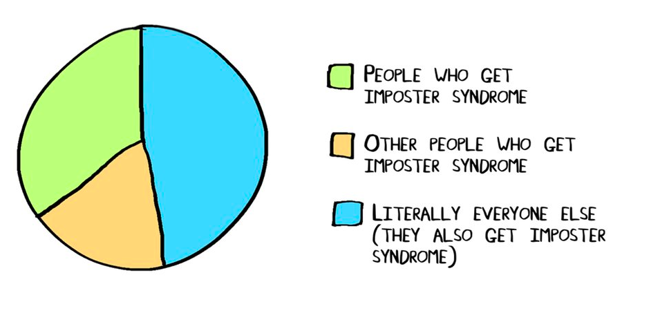

> What’s talent but the ability to get away with something ?

> — Tennessee Williams ( just some guy google suggested )



A couple of months ago, I was reading this awesome book by Nassim Nicholas Taleb called Fooled by Randomness which was supposed to be about some common finance-related misconceptions, how the human brain is painfully bad at dealing with probabilities, and how much does luck have to do with success….reading it….. kind of had a weird side effect, and a lot of introspection, which culminated in this post on something that’s on everyone’s mind and which not many people talk about.

So, you are tagged as “successful” by your friends and family, everyone looks up to you, and believe that everything is going on great with you. And well…for most of it, its actually true, you are really on the fast-lane and things are looking pretty well, until…….

Until something creeps out from a dark abyss inside your brain and whispers into your ear — “ Lol, but you do know you don’t *actually* deserve all this, right? You’re just faking it, right? People will eventually find out, and that will be the end of you ” — Now apologies if that just put you into an existential crisis, but the whispers of this little asshole of a devil, is something that well, more or less all of us have to hear to.

It turns out that approximately 70% of people feel that they are just an “imposter”, that we are just lucky and have no real basis for our successes and someone would eventually find this out and that will the end of it. Well, 70% is just a figure from the net, hell….if you are not one of those narcissists or aren’t dumb enough to even know that there’s a scope of improvement in your current abilities, it's highly likely you’ll experience this. And well, the feeling is completely normal, and usually goes away in a few hours/days, but its when it's stuck, is where the problem begins.

It's when these thoughts are recurring; when they lower your confidence and self-esteem; when they make you overly self-critical and fearful of criticism is when the problem occurs. And well it’s actually so common, that it even has a name ie. “Imposter Syndrome”, and believe me, it's not pretty.

Since I have been myself dealing a lot with this syndrome during the last few months ( won’t go into the details here, but let's just say that you have to be pretty careful to not bite more than you can chew :P ), I decided to write about it as well, maybe as a kind of therapy? Anyway….. let's discuss some of the causes of this psychological phenomenon and some ways to get out of this mindset:

### Causes :

### Perfectionism



Sometimes it's so hard to believe that the work you are doing is actually good. The perfectionist inside you says that “ Dude, you call this piece of trash, ok? You can’t fool people for long with this quality of work ”. Whether it be a piece of code or art or a blog, a perfectionist never feels that what they have done is good. And yeah, some level of perfectionism is great, after all the devil is in fact in the details. But sometimes you just need to let it go and publish your work, and more often than not, people are actually quite welcoming of your work and help you improve it with constructive feedback, rather than dissing you off as an imposter.

### The Social Dilemma



With yet another documentary about the detrimental effects of social media on the “self”, ironically going viral on social media ( The Social Dilemma ), it’s enough to say that social media has finally converted into the Skynet that movies predicted, just not in the form of a buffed up humanoid robot Arnold Schwarzenegger. And yes, sure enough, from inside the pandora's box it has opened, also came out imposter syndrome.

When you open up platforms like LinkedIn, Facebook, Twitter, Reddit etc. ( am losing count honestly ), the place is full of over-achievers. For each one of your achievement, there would be someone 10x times better posting about his/her achievements and hard work and success story etc. And it gets really frustrating when you are working your ass off, but still can’t seem to catch up with these people, which further fuels your imposter syndrome of being “just lucky”. I can’t count how many times have opened up LinkedIn and ended up stuck in an existential crisis.

### F.R.I.E.N.D.S.

Oh, and if you thought plugging out of the social media world would finally help you get some piece, lol, not so fast bro! You can’t escape your immediate social circle. If you are surrounded by over-achievers, braggers, then it's bound to take a toll on your self-esteem. Now am not saying that having over-achievers in your social group is bad, it's great! but just try not to compare yourself with them too much.

Also, keep away from the people who always say that “Oh you are so awesome, Oh you have everything figured out and sorted”. An honest compliment is a great thing and a rare thing to find, but if someone repeatedly showers you with such half-hearted praises, day in and day out, you start connecting your self-worth with it and that’s when all the problems begin.

### How the hell to deal with it?

Now you might have realised that you, just like most of us are suffering from imposter syndrome, but hey, it's alright! While its something which cannot be completely fixed ( and maybe should not be fixed ) there are some things you can do to deal with it positively :

### Actively seek Feedback and Criticism



Instead of being scared of blowing up your farce, and being exposed as an imposter, it's better to actively seek constructive criticism. Ask people that are close to you, like your mentors or close friends what shortcomings they find in your work and where you can improve. I personally feel that as a society, especially in India, we should see criticism in a more positive light and should create an environment where people are not scared to ask silly questions. This culture is already well present in countries like the US, Japan etc where people encourage others to ask even the silliest of questions ( which although can be quite intimidating as a beginner, like when you ask a super-dumb basic question to people who are expert researchers in the field, but that's OK ). In the present scenario, it's pretty hard to find people who give you honest feedback for your work, which also leads you to be confused and ultimately scared of all the potential loop-holes in your work.

### Improve your social circle



They say you can’t choose your family, but you can sure as hell choose your friends. Try to stay away from people who are always talking about their achievements making you feel smaller and smaller (…..damn, even I belong to this category, sincere apologies to anyone reading this who had to deal with me bragging around 😅 ). Also, try to avoid people who always seem to measure your worth based on your achievements and shower you with half-assed praises. Instead, try to surround yourself with people, who actually enjoy being with you, as a person ( its easy to figure out who is actually this way, on your bad days :P ) and people who both offer constructive criticism and are also supportive of you.

### Remember, You are awesome 😃



Remind yourself of all the great things you have achieved. Give yourself a pat on the back for all the seemingly small accomplishments you make and the big ones as well!. Maybe luck really has to do something with bringing you where you are, but hey! it's OK. Luck can only get you so far, you must really have had the talent to be where you are, to have *stayed* at that position. The world is a highly competitive place, and as the father of economics, Adam Smith says in his *Wealth of Nations.* In such competitive and open environments like the current global world,there exists a sort an “Invisible hand” which automatically pushes people to best well-suited place according to their abilities ( actually the theory he proposed was for market prices….but well, it's more generically applicable). And believe me, the entire modern financial theory is based on this fact, and you are not an outlier! You are where you are, because of who you are!

### Learn to embrace your imposter syndrome



All said and done, the imposter syndrome is not really such a bad thing if you look at it from a different perspective. Sure, if you crumble from its weight and go all emo and stop working, then it's awful, but if you have a solid will-power and a lust for learning, you can turn it around for your advantage. Feeling like an imposter means that you are aware of where you lack in your abilities and that insight, dear reader is a godsend. Once you start working on filling those holes in your abilities, you’ll slowly start overcoming the imposter syndrome, start feeling more confident in your abilities, until well….the next wave strikes :P

So well that was it for the post, the imposter syndrome is something that I struggle with regularly and hence the post was written as a kind of self-therapy as well and also with a slight hope that it may help some other lost soul as well, lol, I hope it did…… Anyway, as always, if you are someone I know, and we haven’t connected in a long while, feel free to drop by a message, would love to reconnect and also get some feedback on the blog! Until then, so long!

---

*Originally published on [Medium](https://medium.com/@ayushtues/please-dont-let-them-find-out-i-am-just-an-imposter-19c27ae6302b).*
