### Introduction

There has been a lot of buzz surrounding diffusion models, which are used for a wide range of tasks ranging from text to image generation, video generation, and even protein synthesis.

Given that they are primarily used in the image and text domains, or usually for generative modelling, it’s not trivial to see how they can be extended to be used in Reinforcement learning or why doing this would even make sense.

Unless you start seeing that in RL, we are just generating a trajectory of states, which we want to optimize to have the highest reward. Sounds a bit like conditional generative modelling. We want to generate something conditioned on some property we want it to have ( match a text prompt, have a particular label *or* have a high reward!).

In RL, this sequence is usually generated autoregressively, which is a fancy way of saying that we observe a state and then predict the best action to go to the best next state. But what if we don’t do this autoregressively? What if we generate the entire sequence simultaneously *in a single shot*?

So now, we are generating an entire sequence of states connected in time together. Now, hold up, aren’t images also just a sequence of pixels connected in space? If we can use diffusion models to generate a series of pixels, why not use them to generate a series of states as well?

Turns out, doing this has a lot of interesting properties, which were explored in the work we’ll be discussing today: **Planning with Diffusion for Flexible Behavior Synthesis (**[Diffuser: Reinforcement Learning with Diffusion Models (diffusion-planning.github.io)](https://diffusion-planning.github.io/)**).**

But I am getting ahead of myself; what the hell are even Diffusion Models, or what exactly does RL deal with?

#### Reinforcement Learning



Going into only a few technical details about RL, on a high level, it consists of an agent acting in an environment. Say a robot (agent) walking in the world (environment).

On each timestep t, an agent observes the environment through a State vector S\_t, takes an action A\_t, finds itself in a new state S\_(t+1), and gets rewarded a reward R\_(t+1). The task in RL is to learn a policy π(s), which tells the agent what action to take, given a state s, which will lead to the maximum reward.

Now it gets tricky because we want to take actions that will lead to an *overall* highreward, not just a high one in the current state. Imagine training an agent to drive a car from your home to the office and rewarding it for high speed. While it might make sense to hit the throttle and accelerate locally, it might lead to an accident, rendering you to gain higher rewards in the future and not reaching your goal.

An alternative way to look at this is not considering a state one by one but looking at the *entire* trajectory of states at once and optimizing the trajectory to have a high cumulative reward; this falls under the category of Trajectory Optimization. From the paper itself:

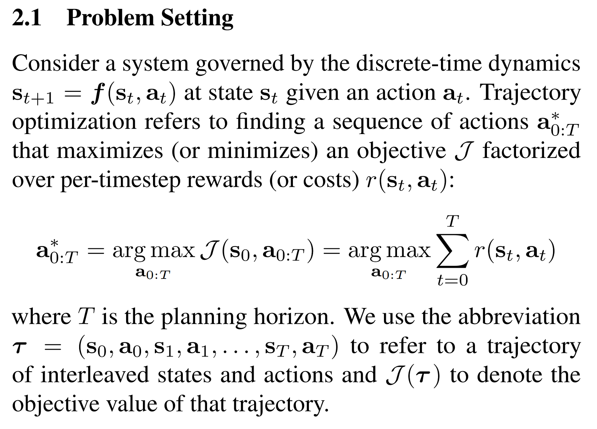

#### Model-Based Reinforcement Learning

Imagine you have to train an agent to drive a self-driving car. Here the environment is well, the real world roads. But can you really train your agent directly on real-world roads? It has two problems.

- **Safety**: You don’t want to crash land your super expensive self-driving car while it’s still learning, and you definitely, definitely don’t want to end up hurting someone in the process. So directly training an agent in an environment might not be safe.
- Training in the real world is also very **expensive.** You can’t really execute a hyperparameter sweep while training in the real world, that is, unless you have a shit ton of cars running like Tesla lol.Directly training in the real world can be prohibitively expensive or straight-up impossible.

Enter Model-based RL; what if you had a model of the real world, a sort of simulation, which can act as a proxy for the real world, in which you can train your agent as much as you want. Usually, these models are fast, quick to interact with, and can enable rapid training. NFL does kick in, though, since a model is always, well, a model. It’s not a substitute for the real world, and an agent performing well on a model of the environment, is not guaranteed to perform well in the real environment.

So how do you learn a model? Wait, what is a model anyway? How is it represented? Mostly, you learn a dynamics model, which predicts what the next state (St+1) would be, based on the current state (St) and action (At)



The function is usually represented by a neural network and is trained by real-world interaction data.

While you can learn a policy using a model, and there are approaches which do precisely that, there is another thing you can do. Think about chess; if you know the model or the rules by which chess work, you can think about what action to take right now, execute it in your imagination, see what states you’ll land into, and then plan again based on it. This is called model-based planning for trajectory optimization.

#### **The problem with Model-Based RL**

Current approaches mostly use learning only for the dynamics model and leave the planning to classical trajectory optimizers with no learning involved.

Now this poses a problem, if you have a classical planning algo, which was designed to work with the real environment, and assume the model they are working with is exactly accurate (ground truth), they’ll try to find a way to exploit the model they are given and find the best way to crack it open.

However, in model-based RL, we are not dealing with the actual environment but a model of it. And a model, however good, is still just a model. It will have its errors in approximating the world. So, if a planning algo finds a way to exploit the model, it doesn’t directly mean that the hack would also transfer to the real world. This problem becomes even worse when we use Neural Networks to learn the model since NNs are prone to adversarial examples, which are examples which look like random garbage but can fool the model into believing that it’s just found the holy grail lol.

So clearly, we need to address this disconnect between the learning process of the model and the planning done over it to avoid such exploitation.

#### **The proposed solution — Diffusion!**

But WTF are Diffusion models? Now this will require a blog of its own, which I might write someday; you can read more about them [here](https://lilianweng.github.io/posts/2021-07-11-diffusion-models/) and also via a simple Google search lol.

**TLDR:** Imagine you have to learn a model which can generate the image of a cat from random noise. Now asking a model to learn how to directly convert random noise to a legible image seems overkill. However, there are models which do that, ie. GANs, VAEs and whatnot ( even something resembling diffusion models called Consistency Models are one-shot ).

But what if I give you a slightly noised image of a cat and ask you to learn a model to denoise it back to the cat? That seems much more manageable. That is what diffusion models do; they learn to slightly denoise an image at each step. And then, they are applied iteratively on random noise to remove a little bit of noise at every step and lead to a clear image.

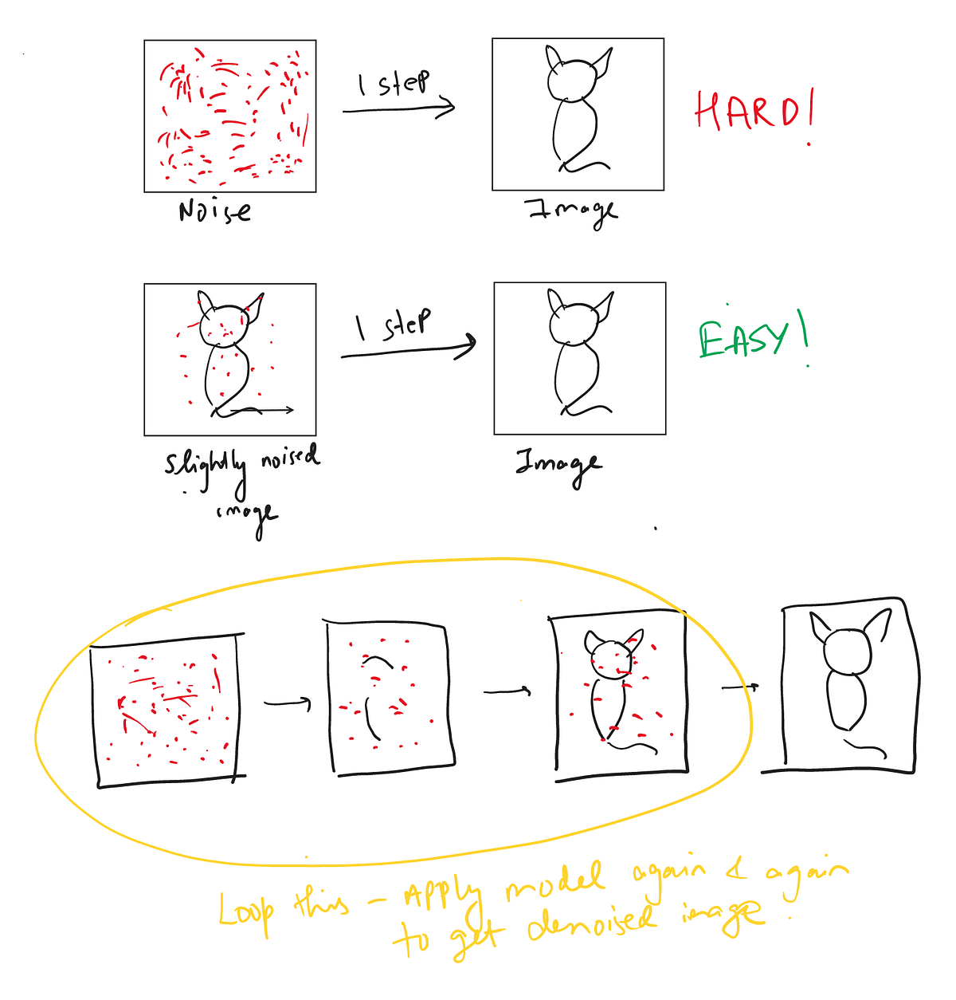

That was the intuition, I’ll just post a bit from the paper for this, to integrate the notation they use

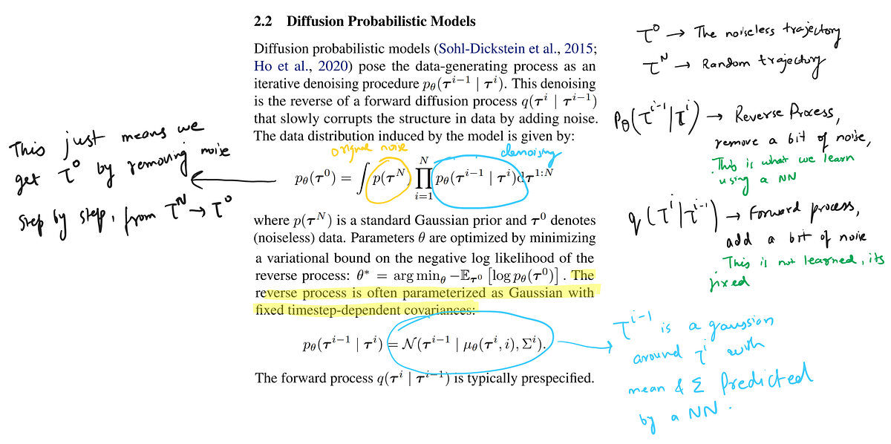

### RL with Diffusion: Diffusers

No, not the hugging face library, lol, although they do have this work integrated ([here](https://huggingface.co/docs/diffusers/using-diffusers/rl)).

So now we want to integrate the model learning and the trajectory optimization as closely as possible; how do we do that?

First, let’s think about what trajectory optimization means in the context of using diffusion models to generate trajectories. We now have a diffusion model, which can generate trajectories following a distribution pθ(τ ). This doesn’t really have any sense of what a good or bad trajectory is, aside from how likely the trajectory is in the probability distribution pθ(τ ).

Trajectory optimization, however, wants trajectories that satisfy a particular condition; they should either have a high reward, end in a specific goal state, or some other constraint. So we want to make trajectories which satisfy these conditions more likely.

Now let’s go back to generating images from diffusion models; let’s say we’re generating images of animals. Suppose we have no conditions or unconditional generative modelling. In that case, we’ll be fine if the output is a cat, dog, bird, or whatever. Still, if we want to get only images of, say, dogs, then we will have to *condition* the model in some way to generate only images of dogs; this is called conditional generative modelling. In the case of images, this can be done by providing the image’s label to the model or a text prompt we want it to follow.

Probabilistically, this means that we now want to sample from a new probability distribution :

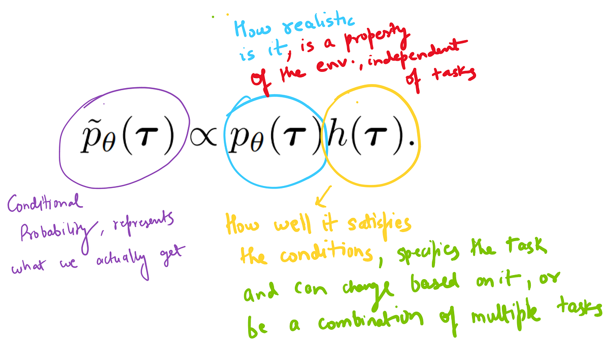

So you convert your probability distribution by multiplying it by h(τ ), representing whatever condition you want your trajectories to follow.  
Then you just sample from this distribution to get trajectories, which are both physically realistic under pθ(τ ) and high-reward (or constraint-satisfying) under h(τ )

A neat this about this factoring is that all task-related information is contained in h(τ ), and is separated from the model pθ(τ ), so if you want to adapt to a new task, you can change h(τ ) according to the task, leaving the model as it is.

So how do we actually integrate this conditional sampling? It is very similar to classifier (or classifier-free) guidance commonly used in image diffusion models, in which a classifier looks at the model’s output and slightly nudges the output based on how it classifies the output to belong to the class required. It’s called a guide, represented by Jφ in this work instead of a classifier.

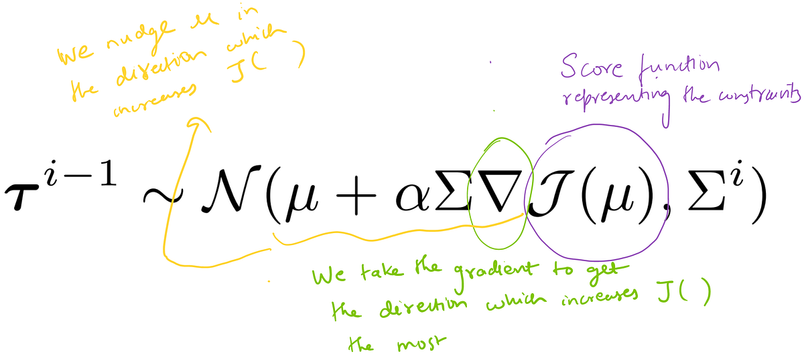

So the steps are :

- We first train a diffusion model pθ(τ ) on the states and actions of all available trajectory data.
- We then train a separate model Jφ to predict the cumulative rewards of trajectory samples. The gradients of Jφ are used to guide the trajectory sampling procedure by modifying the means µ of the reverse process.
- On observing a state, we run the guided diffusion planning, get a trajectory starting from this state, execute the action it tells us to do, get into a new state, and then repeat the process (yeah, we replan in each and every state, kinda seems like an overkill doesn’t it, with all the local coherence and stuff)

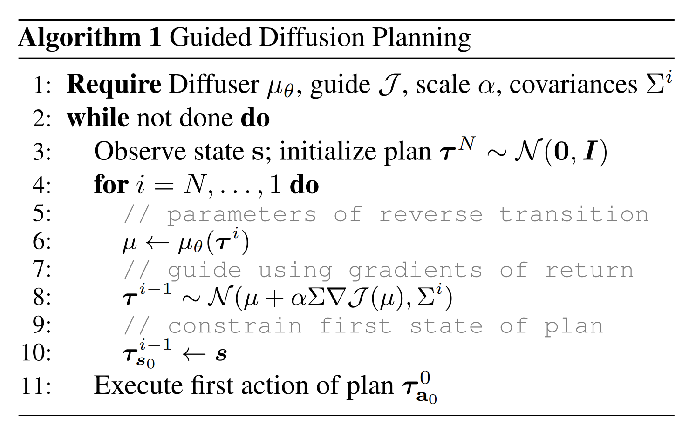

### Designing the model

With the overarching concept of modelling RL as a diffusion process clear, let's look at a few of the design choices that were made to implement this —

#### Trajectory Representation

Before even deciding what architecture to use, we need to figure out how to represent the input and the output. Although in the case of diffusion models, the input and output reside in the same space.

Earlier, the dynamics model only predicted the state, s(t+1) from the current state and action; this was because we were not planning and didn’t care about what action we will be taking; we just wanted to know how the dynamics of the world work.

But now, since we are integrating planning into the modelling itself, we will also need to predict actions, so our input will contain *both* states and actions of the trajectory.

And since we are predicting the entire trajectory, our input will be the series of all the states and actions in the trajectory. So we represent the inputs (and outputs) of Diffuser as a two-dimensional array:

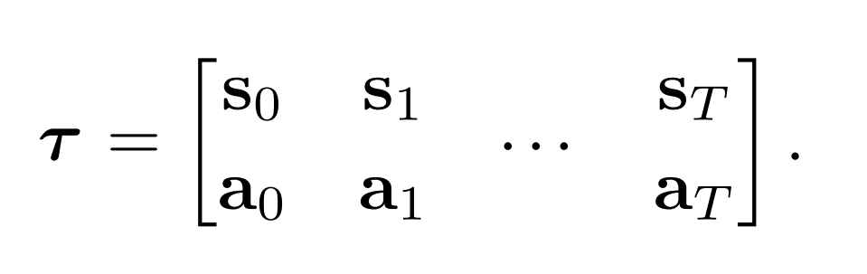

#### Temporal Locality

While we want our trajectory to make sense as a whole globally, we also want to make it feasible locally because the states are connected in time. You can only reach a state in a trajectory from a previous state, so it should, in fact, make sense locally nearby that state that such a transition is possible.

In typical RL, this is handled by the Markovian nature of things, where we predict the next state based on the current state and predict states autoregressively, i.e. one by one.

However, in Diffusers, we predict the entire trajectory simultaneously, meaning we must enforce temporal locality more explicitly. This is done by using temporal convolutions, as seen in the below figure; the receptive field of a given prediction only consists of nearby timesteps, both in the past and the future. As a result, each step of the denoising process can only make predictions based on the local consistency of the trajectory.

However, when we compose many of these denoising steps together, the local consistency can drive global coherence; think of it as how the effective receptive field in image models increases by applying more and more convolutional layers.

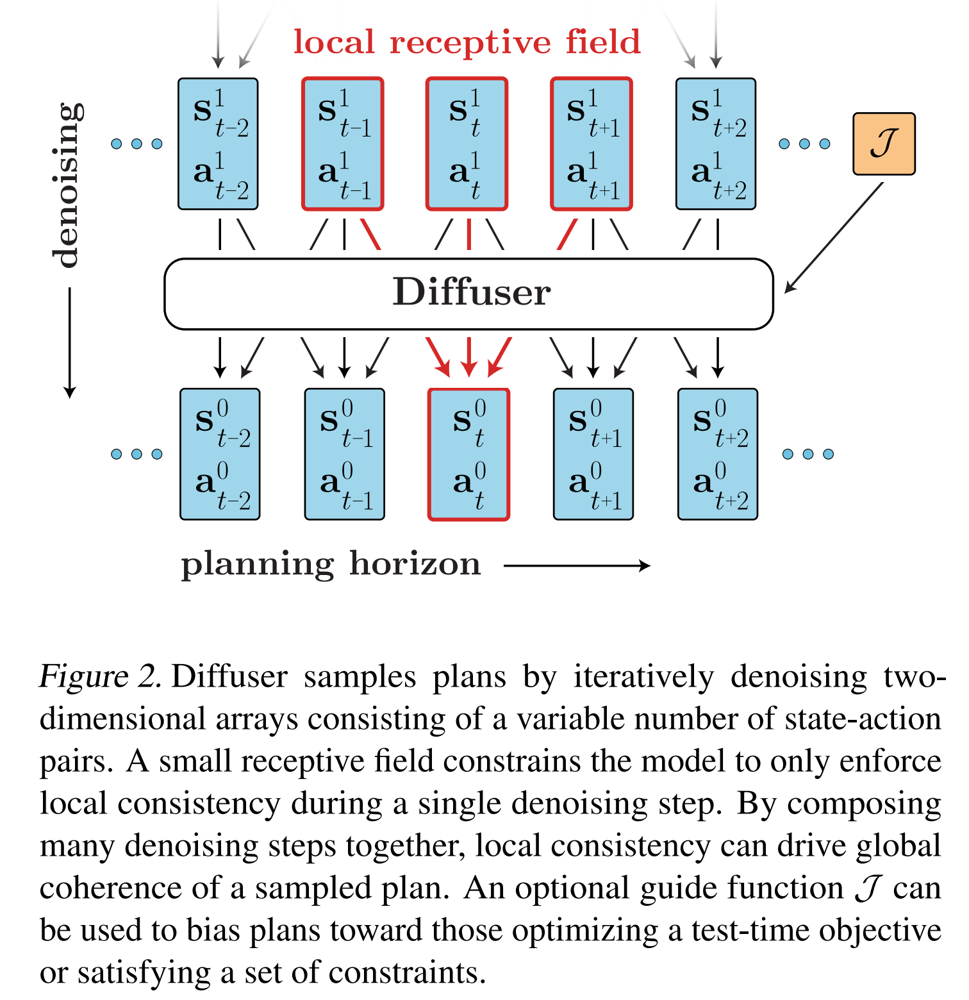

#### Architecture

They use a U-Net, which is typical in image-based diffusion models, but with two-dimensional spatial convolutions replaced by one-dimensional temporal convolutions, since while in images, the pixels are connected through space, here the states are connected across time.

Because the model is fully convolutional, the horizon of the predictions is determined not by the model architecture but by the input dimensionality; it can change dynamically during planning if desired. This is the same as fully convolutional image models being able to handle images of any resolution; the spatial resolution of images corresponds to the temporal length of the trajectory in this case.

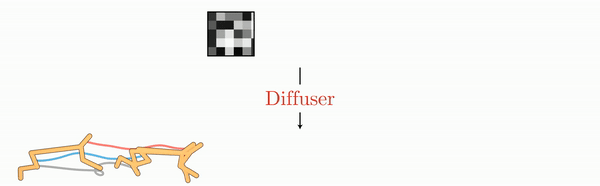

#### **Goal Conditioned RL as Inpainting**

One of the most incredible things I found with this work is how smoothly it integrates goal-conditioned RL. They treat it as an inpainting problem, which is already heavily explored in image models, where you mask out a part of the image, and ask the model to fill it based on some conditioning.

Here, say if we want to reach a goal from a particular state, we treat it as an inpainting problem, with the first and last state specified and the other states to be inpainted by the diffusion model!

What’s even cooler is that this doesn’t restrict to just a final goal state; if you want to constrain the trajectory to pass through certain intermediate states, specify them in the inpainting input, as simple as that!

We can also see this as h(τ ) consisting of just 1’s at the first and last state and 0 at all other states, as shown in the below figure.

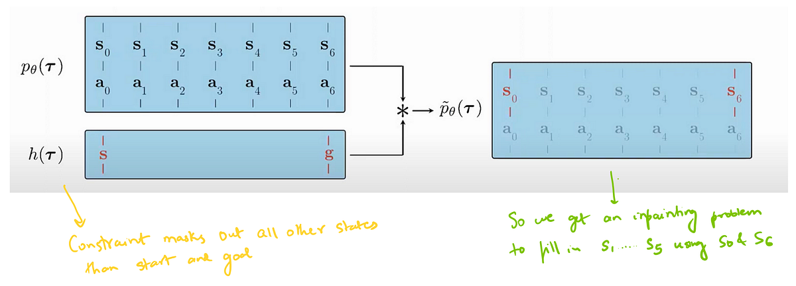

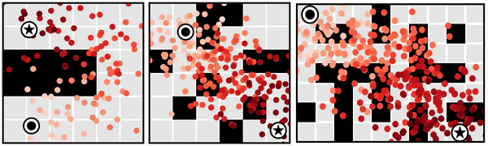

### **Properties of Diffusion Planners**

**Learned long-horizon planning** — The authors claim that since in diffusers, the planning is integrated into the dynamics modelling process, if the learnt model is good at predicting long-range trajectories, their process will also be good at long-horizon planning, since planning is the same as modelling, just with a conditioned probability distribution. They show their approach can avoid myopic failures and solve sparse reward settings where other methods struggle.

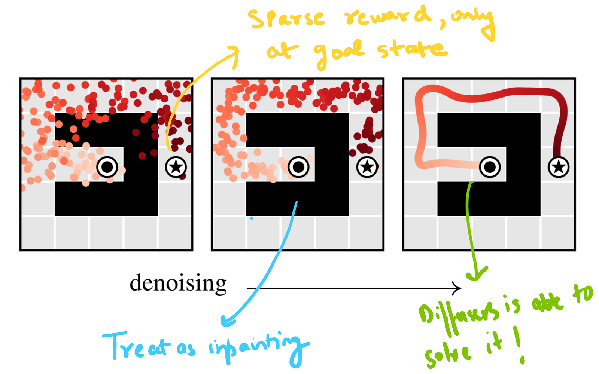

**Compositionality —**Markovian models, which are very local, and take decisions based on a particular state, can stitch together different parts of trajectories during training to generalize to new ones. Since the decision only depends on the nearby states, if they observe the grey trajectory, which is always going upward and the blue one, which is always going downward from the centre, it has learnt both motions around the centre state, so it can learn how to take a turn since it only depends on the local context, and not if the rest of the trajectory is going up or down.

The authors claim that due to the local receptive field of the temporal convolutions, diffusers also adapt this property and can stick together trajectories to generalize to new ones.

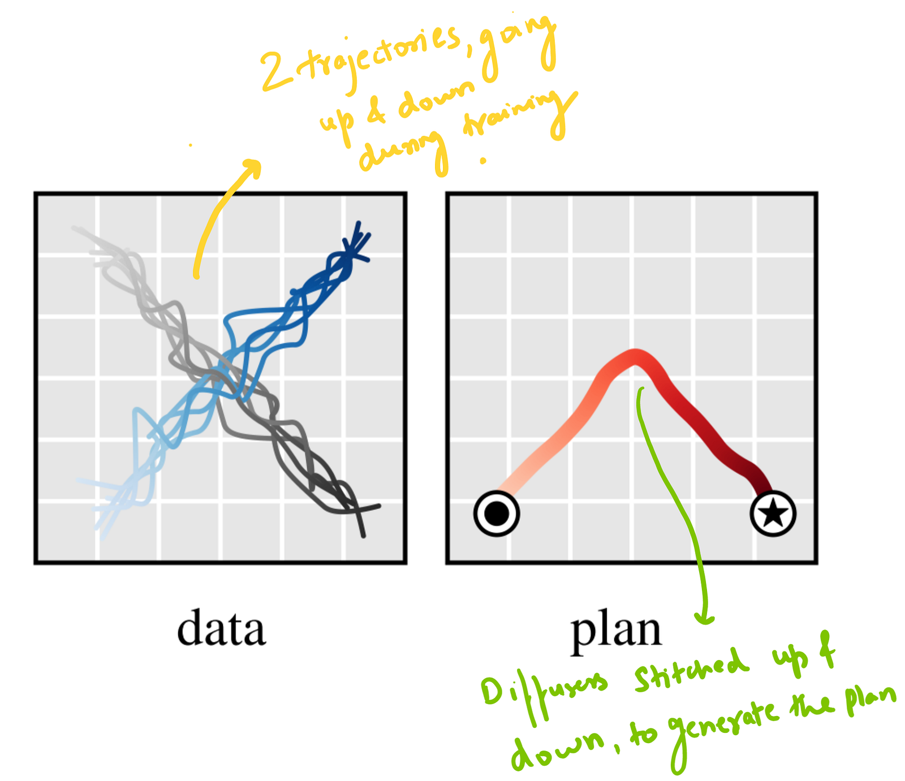

**Variable-length plans:** Because the model is fully convolutional in the time dimension, it can adapt to variable-length plans.

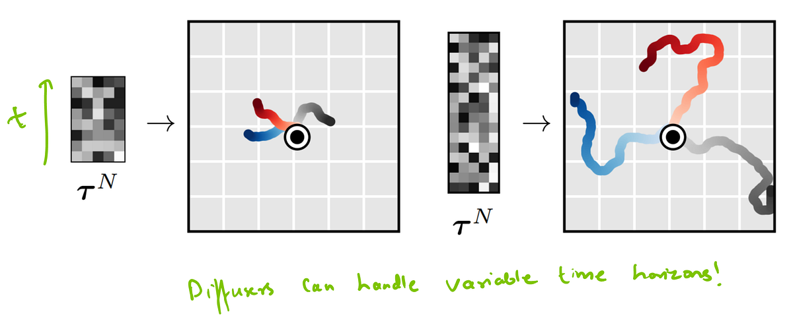

**Task compositionality** — Since all task-related information is contained in h(τ ), and is separated from the model pθ(τ ), so if you want to adapt to a new task, you can just change h(τ ) according to the task, leaving the model as it is.

You can get some crazy stuff from just training a single model pθ(τ ) and changing the constraint h(τ ); the model is able to adapt to a variety of stacking tasks

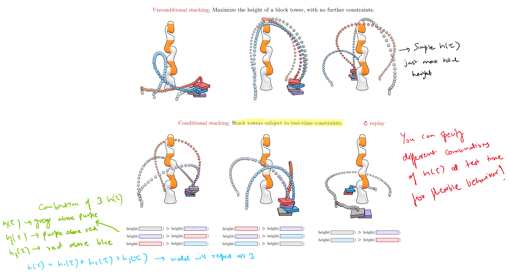

#### **Warm-Starting Diffusion for Faster Planning**

So all this is good, and it seems like this model has no flaws.

Well, not really; one of the main limitations of the paper is that the approach could be faster. And this is a common problem with diffusion models in general; since they involve iteratively applying the model again and again t denoise, they are very slow.

Add that to the fact that in planning, we run the entire process at every state; it gets even slower.

To make the approach a bit faster, they say that we don’t need to entirely discard the plans generated at every state, since they are also helpful for nearby states.

So you can take the plan from the previous state and use it as a warm start for the planning in this state. You do this by noising the previous plan a bit and then denoising it using your diffusion model. Still, since it’s mostly a well-structured plan with a little bit of noise added to it, you just need to run the diffusion for a few numbers of steps to tweak the plan based on your current state. This is shown to increase the speed a lot while hurting the performance slightly, as seen in the figure below.

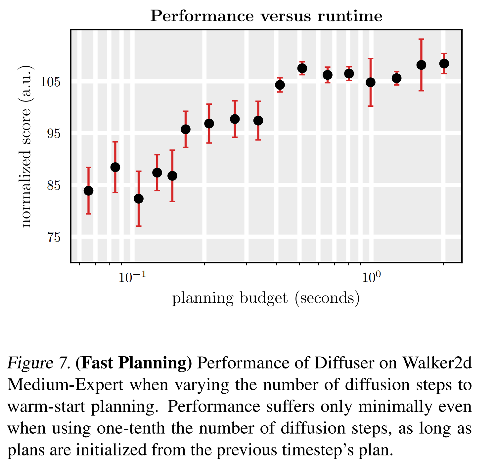

### Conclusion

So that concludes one of the ways in which Diffusion can be used for RL, there has been a cool follow-up which uses Diffusion for Offline RL : [[2211.15657] Is Conditional Generative Modeling all you need for Decision-Making? (arxiv.org)](https://arxiv.org/abs/2211.15657#:~:text=Our%20results%20illustrate%20that%20conditional%20generative,modeling%20is%20a%20powerful%20tool%20for%20decision-making.), you can also find a list of other RL + diffusion works here: [opendilab/awesome-diffusion-model-in-rl: A curated list of Diffusion Model in RL resources (continually updated) (github.com)](https://github.com/opendilab/awesome-diffusion-model-in-rl).

Overall I feel that this paper was quite novel in how it seamlessly integrated Diffusion with RL and showed that it enables a bunch of cool properties that might be desirable in RL. They also integrate with Diffusers, which is always nice for diffusion models.

I might cover some other RL + Diffusion papers soon, or update this blog with some demos from the colab, so stay tuned!

---

*Originally published on [Medium](https://medium.com/@ayushtues/rl-with-diffusion-i-d64c6e96d5ed).*
