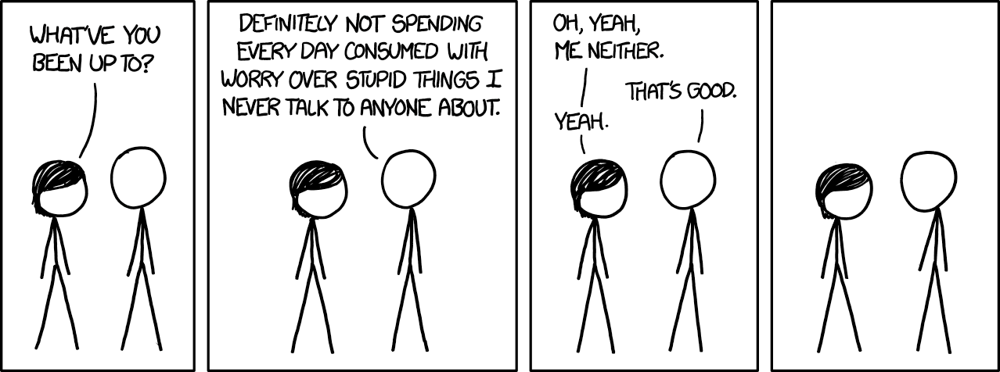

I was reading a blog somewhere online, at Less Wrong ( [The Level above mine](https://www.lesswrong.com/posts/kXSETKZ3X9oidMozA/the-level-above-mine)), one of those rare online gems that you happen to know about after waaaaaay too long in your life, that we can’t identify intelligence at more than one standard deviation away from our own level and anything over that just blends into well “genius”. That made me thinking that where do I stand and what level of intelligence am I sensitive to, and what am I oblivious to?

I have been considered “smart” by the people around me ever since I was a child, it started from being the topper in the class in school, to being pushed into a hyper competitive race during my high school and then being a part of the “elitist” society of tier-1 college grads in my country. I think this assessment lays from the fact that I *might* have a slightly higher than average IQ, while still being at a level at which normal people remain sensitive to changes in intelligence. It also was an easy explanation to two facts 1) being my total lack of aptitude in anything other than acads and giving people a way to justify that by giving me the “oh he’s a genius, they tend to be weirdos anyway” pass 2) it served as a relatively easier explanation to my academic success than the others simple. fact that I just worked hard lol

This uni-dimensional analysis of my personality, where the only redeeming factor of myself as a human was the fact that I am “smart” led to a bunch of problems for me as a functioning member of human society, which in fact requires you not just to be smart but also, a bunch of other things like I don’t know, kind, gentle, humble, wise, charismatic/ a potential sociopath who mocks all these qualities while actually planning a serial murder? How was I supposed to suddenly learn all these other qualities which are now more important than me being smart? How do I fit myself into society, how do I keep up with the dumb as hell questions of my relatives at family functions without sounding like a total uninterested asshole or worse, a smartass?

Another problem, which occurred slightly late in life, is the fact that being “smart” is relative, to the people surrounding you. I was “smart” in my school, based on my peer group then. But ever since I entered college, joining the so-called elite club of the engineers of the country, the average IQ of the people surrounding me shot above, probably (most likely) beyond my own ( ALSO, I know IQ is not a good measure, and its not the only measure of intelligence, and there are other forms of intelligence, and blah blah, but let’s tackle the simplest case shall we, I am fucked in EQ and SQ anyway :P ). When you are used to being called “smart” and take pride in it being something that distinguishes yourself from others, what happens when everyone around is just as smart, if not more? Well, shit… shit happens.

Suddenly being thrown into the lower rungs of the intellectual scale, while being used to occupying it upper echelons, warps the space around you and makes you lose sense of your (mental) direction, and you’re left, lost, questioning to yourself and to the people around you…how the hell do I reach back to the top? Anything and everything you do is accompanied by the dreadful question of, am I smart enough for this? Am I doing the right thing? Is someone more suitable for this than me? Does any of this matter, do I matter? Imposter syndrome runs amok your headspace rent free like that latest anime song (BLING-BANG-BANG-BORN, who the best, I am the best!!)

Not to say that, its not incredibly humbling as well to be sooooo outmatched by your peers in terms of their sheer intelligence that it gives you a deeper appreciation for the importance of the *other* things that we mentioned previously. You appreciate that while you can’t be smarter, you can be kinder, gentler, and overall more understanding of the people around you and not be a smartass all the time. You appreciate the importance of working hard, even if you know you are outmatched intellectually, still trying anyway, to give it your best shot. Whatever you aim to do, has probably already been OR can be done 10x better and faster by some much much smarter than you, but that doesn’t mean you can’t give it a shot. The world exists at all scales of existence, you will eventually find your own plane, and maybe if you aim high enough, surrounded by these being occupying a higher plane of existence, you might get a peek at their lives and model yours around it, a bit, as much as possible.

---

*Originally published on [Medium](https://medium.com/@ayushtues/smart-enough-07040e2f6675).*
