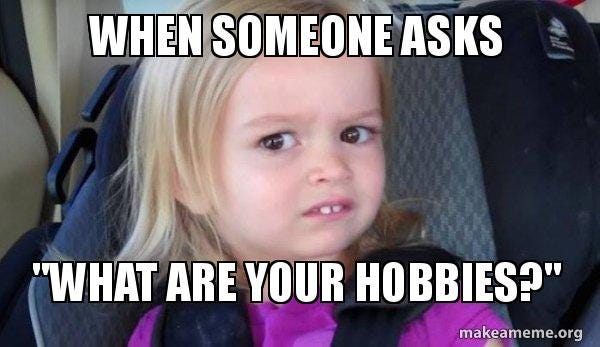
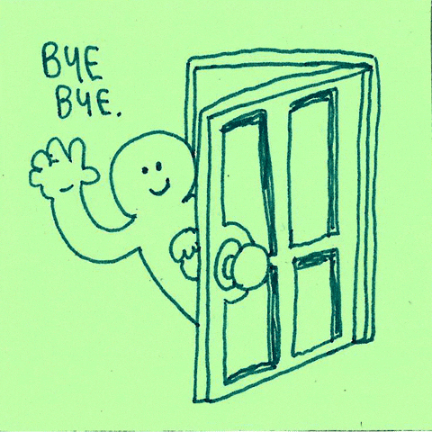

> TLDR : Got anxious, mind started wandering, started overthinking about useless stuff, and finally ended up in an existential crisis as usual, wrote a blog in the process, nothing new, seriously…….. skip this, and go read something better *😛*

Imagine this, you just met a new person , or got into a new social group of some kind or maybe you are just interviewing for a potential career opportunity. You are brimming with excitement to introduce yourself, to put yourself out there, and let people see how fucking awesome you are, and it goes on good for a while, that smug confidence you take pride in, is working its charms and people seem interested in knowing your more, but then you sense something happening…..ah fuck, no please no, don’t, don’t say it, not again…….you try to quickly maneuver the conversation, hoping to avoid the inevitable, and then bam, it happens again, and you crash-land on your face…. someone asks, *So…..what are your hobbies?*

There are many questions that put me into an existential crisis, making me question my entire existence, like *what’s the point of life* ( there’s no point )*, what’s your future plan* ( I have none )*, what am I doing with my life* (wasting it ), ormy mom’s *what do you want to eat for dinner?* ( she ends up deciding it herself anyway). I can probably write a blog about each of them, but these are mostly questions that I have to face from people relatively closer to me and are relatively infrequent ( other than the dinner bit ), but today I wanted to talk about a question I have to answer again and again , all the time, in literally *any* situation I have to introduce myself to others, like seriously, who the fuck invented this torturous ritual of asking people, *So…..what are your hobbies?*

Whenever I am asked this question, I get very confused, and anxious, since I don’t really feel like I have any hobby, atleast like other normal people seem to have. Sure I listen to music, keep on reading/watching random stuff on the internet, but they don’t seem to fall in the normal “cool” hobbies like painting, or dancing etc that people usually expect you to answer. This leads to me questioning my existence, and I often ( reluctantly ) end up answering something like “I have no hobbies” or “ah….watching animes?” And it doesn’t take a mentalist to guess what the other person’ feels about me after this xD



Anyway, let’s first define what a hobby is, we’ll use our usual trusty go-to source of wisdom, Wikipedia ( as a side note, I recently came to know that even in industry settings, information on Wikipedia is considered to be kind of a gold standard in quality, which seems a bit weird, since I literally go edit any page on the website right now lol)

> A hobby is considered to be a regular activity that is done for enjoyment, typically during one’s leisure time. Hobbies include collecting themed items and objects, engaging in creative and artistic pursuits, playing sports, or pursuing other amusements. Participation in hobbies encourages acquiring substantial skills and knowledge in that area

Now it is definitions like these, that make answering this question such a hard job. Firstly it says a hobby needs to be something you do regularly, well you know what, I can’t keep on doing *anything* regularly, I can’t schedule a time everyday to journal ( failed attempt count to keep a journal tending to infinity ), or to practice an instrument ( same story here as well ), something like this just doesn’t work for me. Hell, I can’t even watch animes regularly, instead it usually happens in like short periods of binging, where I end up watching an entire series in a single sitting. So hell no, if a hobby is something you have to do regularly, I’ll remain hobby-less forever.



Next, hobby is something done for enjoyment, typically during one’s leisure time. Ah well, lol, HELL NO. Not unless enjoyment means escaping from your boring normal life, which seems so mundane, that you can’t stand another minute of it, so you hop on to that random youtube video, or that new cool anime, or even start writing your blog, *even* during your work hours ( usually in your work hours lol ), since you anyway can’t concentrate on the boring work you are doing. The fact that you classify some stuff you are doing as “fun/hobby” and other as work, is a signal that something’s wrong somewhere according to me.

*Hobbies include collecting themed items and objects, engaging in creative and artistic pursuits, playing sports, or pursuing other amusements. Participation in hobbies encourages acquiring substantial skills and knowledge in that are.a* Well my “hobbies” consists of binging animes, watching random youtube videos, just listening to songs for hours, and overthinking about stuff, so does that mean I haven’t got a hobby? If a hobby is meant to be something you do for fun, why do we need to associate it with a few cool stuff like painting or reading or playing a sport….why isn’t binging random stuff on the internet considered a hobby? Also well I don’t know about you, but I don’t consider myself having substantial skill and knowledge about anything, well sure I know my fair-share of anime trivia, like what’s happening in the latest chapter of One Piece or My Hero Academia, but I don’t think that something that’s meant to be done for fun, should necessarily be related to acquiring skills, can’t we just do things for fun?



Okay, I guess that’s enough rant for a blog, but I do feel if hobbies are meant to be something you do for fun, you don’t need someone else’s pre-existing definition of what a hobby is to bind you, and make you feel bad about not having a “cool” hobby. So maybe the next time when someone asks you what are your hobbies, just try being honest about what you enjoy doing in your free time, it could be something as weird as watching people reacting to people reacting to people reacting to people xD

Anyway, that’s it for this blog, as usual feel free to hit me up, and let’s have a good chat!

Until then — Stay Safe!

---

*Originally published on [Medium](https://medium.com/@ayushtues/so-what-are-your-hobbies-b438626a764f).*
