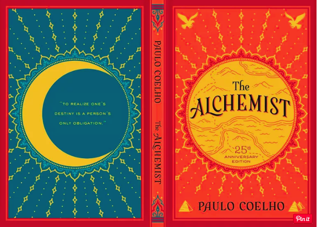

> When you want something, all the universe conspires in helping to achieve it.

Sounds familiar right? It sure did to me. Now I am by no means a fan of SRK, I don’t even watch Bollywood movies anymore (the last one I watched was Chhichhore somewhere around 5 months ago and before that Jolly LLB2 and that was 3 years ago) but before I got a bit older and supposedly became too cool to watch Hindi movies, I had sure as hell watched Om Shanti Om as a child and enjoyed it thoroughly 😅.



There you go — It was a pretty good dialogue, wonderfully delivered by SRK. But little did I know back then, that I would find the same dialogue, years later in a completely unexpected scenario.

> Just a little disclaimer — I don’t really write for others to read, I write, cause, well there are many reasons for why I write, maybe I am bored, or I might have too much on my plate and want to switch off from it for a while. So this is not gonna be a well-designed article. It will have a lot of unrelated personal stuff about me. It’s my habit to say whatever I am thinking at the moment to people whether or not it’s related to the talk, so I can’t completely get rid of that habit while writing also*😅*

### A little bit of info about me…Okay …Maybe not so little :P

> Feel free to skip this part if you are someone who already knows me or isn’t interested in knowing me …it’s my views on myself …its gonna be biased by my hubris anyway

I am Ayush Mangal…a normal 19-year-old guy, hailing from a relatively small city called Gwalior in Madhya Pradesh, India, although I am currently living in this beautiful small town called Roorkee in Uttrakhand, India for my college life. I really love small cities because of their slow pace and simpler life, I lived in Banglore for around a month some time ago and yeah …being in a big city is great and all …the thrill of seeing those huge buildings/malls with all those great shops which have anything you want is great and all, but to be honest, I prefer a simple and quiet environment over the hustle and bustle of these large cities …maybe it has something to do with the introvert part of me. But ah well …it seems like I’ll inevitably have to move to a huge city someday …for a better life, whatever that’s supposed to mean.

Anyway, I usually come about as this extremely boring guy who cares about nothing else but his academics, has little to no hobbies, has a virtually non-existent social life, and is, in a nutshell, a good for nothing except for maybe getting some marks in exams. and no, I am not pessimistic, I have actually asked many of my old friends of how they remember me …that’s what they usually say or mean to say but are reluctant to say it to my face.



And yeah that’s true to a large extent, as noticed by many people around me who actually know me well, the single most dominant trait about me is my habit of overthinking, and over-worrying and that habit (which also gave birth to this post) has made me into a person who is lost in thoughts of the future and never really lives the present (yeah I know, pretty cheesy stuff). I think my mind has been conditioned by the older people around me since I was young to believe that the only way to a secure future is through studying the hell out of your childhood and my brain, being the fickle little devil it is, took that as the truth, and although I now know that it’s not true, I am honestly too afraid to come out of my little comfort bubble that has been developed for the last 10–12 years or so.



As for my social life, I don’t know, I don’t like the question — “Are you an introvert ?”. Something as complex as someone’s personality can’t be binarised into a dichotomy or even into a trichotomy including the third ambivert category. Typical “extroverts” also have some introverted tendencies, and the reverse is true too as well. Maybe I’ll write someday about the complex spectrum of introversion and extroversion. That’s something I have thought about a lot.

Anyway, I have kind of a simple rule



I usually don’t care enough about anyone to take the first step to start a conversation, that often leads to the impression that I am, I don’t know, rude, proud or simply a jerk and that lead to me finding it hard to make friends in a new place like my college, especially with the opposite gender, for which there is supposedly some unspoken law that it’s necessary for me to start the conversation, leading to me having made little to no friends amongst them in my entire life. And although I usually don’t care about it much, it does make me sad sometimes that I must be missing so much because of it, cause, to be honest, I really like talking to people, I just can’t bring myself to disturb someone I don’t know well with a random conversation.

Also, even though I really am good for nothing except studying, there are still some other things that I love. I love reading a lot. It’s my favourite timepass during the boring lectures at my college or whenever I have to wait somewhere alone. I also love listening to music, and you can always find me with earphones attached when I am at my room (much to the annoyance of my parents)…or sometimes even in the classroom, Also, I do recommend you to try Youtube Music, I usually listen to songs on Spotify, but I tried Youtube music whilst writing this blog and take my word for it, nobody gives recommendations better than youtube, well maybe Google does, but google owns Youtube too now :P

I am also a self-proclaimed otaku, having watched anime daily since the last 5–6 years, I got this habit back in 9th standard when I joined my coaching classes and met some people who used to watch animes. So I also got into the habit of watching animes ( I started with Inazuma Eleven if I remember correctly) and soon got hooked to them ( there were time’s when my mother caught me watching anime at 6 AM when I woke up early to study😛). It was pretty sad that when I came to college, people didn’t seem to really watch anime over here, and kind of think of it as something childish and cartoonish. Although I was still able to connect with some people who loved anime as much as I did and yeah…that was pretty cool.

Okay, …that turned out to be quite a lengthy introduction, but I really don’t care, I wrote whatever came in my mind, and you know what …it feels awesome to express your mind through writing. Especially during this lockdown period when there isn’t really anyone to share your thoughts with, Anyway, I know this all feels pretty out of place, its cause, it is. I didn’t really plan this post out very well and this kind of happened on a whim….okay for that matter, let me tell you how this post happened.

### How this post came out to be?



Okay so this is my first blog post ever, and like a lot of other things I have tried out….it sort of happened randomly

> I wrote this post in sort of in a non-linear fashion time, so there would be stuff like last night, yesterday, tonight, which actually correspond to different days, also talking about non-linearity, checkout this awesome anime called Baccano, it focuses on a bunch of seemingly non-linear stories which all make sense in the end :P

So last night, I had a talk with a really old school friend after a long time ( I sometimes talk with random people…who I haven’t even talked for a long time, it’s fun seriously….reconnected with many peoples through this), she is an awesome person, I have talked with her a few times in the last year and she’s like that type of person who tries everything out in life and has a very exciting life and also is cool enough to converse with a random guy like me who could also be a potential creepy stalker for all she knows :p ( Oh I really hope she doesn’t read this lol….if she is reading this right now….then ah well…fuck it …doesn’t matter 😛). Anyway, I discovered in the convo that she also writes some original stuff ( which is totally awesome btw) and she was also good enough to share some of it with me and yeah, sure enough, she wrote some awesome stuff!

Now seeing her write all this awesome stuff made me also try writing out, So I decided to write about something. But what should be that something? Well since it’s my first post…and you always remember your firsts….I wanted it to be about something that is special to me….and that would be books/anime/music (Yup I know ….I am a pretty boring guy). I wanted to go with anime…since it’s less represented in blogs and stuff and I really want to improve that situation ….but that turned out to be quite tough to pull out …. so I thought I’ll just write about books

Now if memory serves well, it was during the midterms examination of my 3rd semester that I came across this small book — The Alchemist — By Paulo Coelho.

I was going through a phase of my life when I had recently tried to cut off watching animes and quit social media ( I was a total social media addict back then, be it FB or Instagram) and I’ll be honest, I was doing quite well for someone like me who makes a new rule to improve himself every day and then takes the saying that “rules are meant to broken” quite literally 😂. ( Lol …I never seem to improve though…its quarantine time now and I am binge-watching Psycho-Pass currently)

Anyway, doing so left me with a lot of free time, which I used to try out some new stuff, like learning guitar, hitting the gym regularly( I know I am making it sound like I was being super productive and stuff but, believe me, that’s far from true, I haven’t done anything since the morning and finally came to write this blog since I was bored as hell….but hey…you gotta put up a good first impression, don’t you 😛).

It was during this time that I re-started my habit of reading books and novels and stuff, something I did a lot during my 9–12th — No, not my course books, I am talking about series like Percy Jackson ( I am a huge-huge Rick Riordan Fan — I have literally read all the similar series written by him), Harry Potter ( I don’t like cheesy epithets like Potterhead, Sherlocked and similar stuff people put on their Insta bios, but yeah I loved the books and also went around reading 4 fanfictions on James Potter as well) and other similar titles.

But I had left this habit when I came to college — cause well, nobody likes a nerd who likes to read books for fun, and I was already nerdy enough, to begin with. Anyway, I started reading books again when my second year started, cause well — after having lived the first year of my college life in a place with only 5–6 people around me….I had stopped caring about people’s opinions, cause there weren’t many people to give their opinions around me anyway 😛.

So I had already read some books that semester and was all set to start another one. I googled a bit and found people going crazy about a book called “The Alchemist”. So I decided to give it a try. Now I am by no means a fast-reader. I usually take ages to complete a book and if I remember I had my midterms in a few days. I usually go full-on study mode during that period. But this was different. I got hooked to the book. I have never got so intrigued by any other book before and to my surprise I binged the book and completed it within a day.



I decided the book to be The Alchemist. To do justice to the review I read the book again, and although I already knew what was about to happen in the book from a plot perspective. I got hooked to it again. Now that’s the beauty of the book. Its plot doesn’t have much importance, it’s the concepts, the lessons in the book that are brilliant. But anyway I’ll give a brief plot summary of the book.

### The part that is actually about the Alchemist :P

So the protagonist is Santiago, a young shepherd, and a hopeless romantic who is having a recurrent dream about a treasure stuck somewhere near a pyramid in Egypt. He gets his dream interpreted by an old woman, and uh …meets …an avatar of God? (Wtf, I am an atheist dude, why did I even like this book). Who tells him that it’s his destiny to find the treasure. He says …cool…thanks for the tip about the future dude! He takes the advice of the random stranger, sells away all the sheep he has, goes to Egypt, then meets another man, who tricks him into giving away all his money (the boy wasn’t a bright one, to begin with really). The boy says cool…I’ll just work somewhere to get more money. (Ah how I wish I was this optimistic), He then works in an old crystal shop, gets pretty wealthy. Joins a caravan going to Egypt. Some shit happens and he meets a mysterious guy called the Alchemist, who teaches him some hippy stuff and converts the boy into an alchemist. (People who can turn pretty much anything into anything, like lead into gold, human into the wind and also are immortal due to some liquid they developed). He then reaches the pyramids and realised there that the treasure is at the same place where he was having his dreams.

Okay, now I know this was a pretty shitty description of the plot. Cause well …the plot doesn’t really matter, its the quotes in the book that are brilliant. Oh and one more thing, I’ll majorly be focusing on the first half of the book, cause after that the book focuses on stuff like love and some other fantasy shit which I find pretty irrelevant 😅

So what I basically did while re-reading the novel is that I extracted all the quotes that I found interesting in a google doc. I got around 23 quotes, now obviously I can’t cover 23 quotes in a single blog post, and given the current COVID circumstances, I don’t even know if I’ll even live long enough to write a second part.

I had to somehow compress those 23 quotes, so I clubbed some of them which were based on similar concepts and also asked one of my closest friend, who also happens to be a pretty awesome writer to select the top 7 quotes he found to be best, I finally ended with 5 sets of quotes.

> Everyone seems to have a clear idea of how other people should lead their lives, but none about his/her own .

> I am like everyone else — I see the world in terms of what I would like to see happen, not what actually does.

> When you possess great treasures within you, and you try to tell others of them, seldom are you believed.

When Galileo tried to convince the world that the earth is heliocentric, the world declared him a heretic, when Elon musk started selling flamethrowers people thought he was just a lunatic ( maybe he is 😛), anyway, the point is all of us are a bit too judgemental.



I have some friends who recently started working on their own startup, they asked me to join in to help develop it, they really believed in their idea, but to be honest I just straight away ridiculed their idea. Fast forward around 2 months, their idea won an ideathon, got invited to the finals of Hult Prize Scholarship( a 7 crore funding) at Jordan (although that got cancelled due to corona 😅), but the thing is, they found something good, something worth exploring, they tried to tell me about it, but I just saw everything in the way I would like to see. I thought about how the technical aspects seemed primitive but couldn’t see the bigger picture they were focusing upon, cause that’s what I wanted to see, not what they wanted me to show ( I hope they don’t read this though….that would be embarrassing….I used to go to the gym with one of them everyday lol).

Coming to the first one, whenever someone asks me for some advice…whether it be for academics/coding/general shit or for that matter sometimes even their relationships (which I have no experience in, and thus shouldn’t really comment upon, but still do when people ask), I always think that it’s so obvious what their problem is and that the solution is pretty obvious, but when it comes to my problems, which are often mostly focused around my career, I have no idea what to do about them, I keep stuck on my problems for months to no avail.

> At a certain point in our lives, we lose control of what’s happening to us, and our lives become controlled by fate. That’s the world’s greatest lie.”

Okay, so this is an idea I highly believe in



No, not this crap, I seriously do believe that whatever happens to me in life, is just a result of my actions and I am wholly responsible for it. Although my friends still always have to listen to me rant about how unfair life is, and how everyone seems to be hellbent on fucking up things for me,….. but hey, that’s just my coping mechanism :P

Deep down, in my mind, I know that it’s all a result of my own actions, I don’t really believe in the notion that everyone has a pre-destined path made by some oh so almighty God and we’ll just have to accept it, I really hate it when people, like my parents, say “Bhagya ye zyaada aur Samay se Pehle, kisi ko kuch nahi milta” (Nobody gets more than what fate has decided for him/her and before the right time comes). I mean like this is the worst possible philosophy to live your life with, heck even physicists agree that the world is non-deterministic in nature ( Sorry Classical mechanics ….you suck!).

Though I do believe in all this, I do know that yeah…sometimes it feels like there isn’t really much you can do about the things that are happening to you, I mean I am not really one to talk about it…since I am really at a lot more privileged position than many other people in the world ( for which I am really grateful for actually) and I haven’t actually experienced any real hardship in life per se, but still I have watched interviews or read about so many people ….like really successful and famous people, who all had pretty major setbacks in life, enough to make anyone feel as if their fate doesn’t want them to be successful, that every single one of them fought back against that so-called fate and came out stronger than before cause oh well



> Once again he saw that in that strange land, he was applying the same lessons he had learned with his sheep.- All things are one

All things are one — That’s the basic concept behind alchemy as introduced in the book, they say that everything is the same at its core, you can look at a grain of sand and see in it all the marvels of creation, and since all things are one, lead can be converted to gold, since they are essentially the same thing. Now, this was something from the second half, which didn’t make much sense to me. But there is something in it, as mentioned by Santiago in the above quote that did make sense, that solutions found in problems faced in one aspect of life, could be actually found to be applicable everywhere.

Let me give an example, most of the research that has happened in my field has been developed by studying nature, by observing nature and applying lesson's learnt from it into developing fucking AI’s ( Ah well I know this might reinforce my already nerdy image…but well …don't really care)

I have also observed it on a personal level, people who tend to explore things a lot, also tend to be quite good in things than normal people ….lesson’s learnt in one task help a lot in other tasks ( Heck there is even an entire research area called Multi-Task Learning in my filed entirely based on this concept), I have tried to apply some organisational skills learnt during my intern and via contact with some more experienced people to other aspects of my life, which does seem to have improved my productivity a bit.

> It’s called the principle of favorability. When you play cards the first time,you are almost sure to win. Beginner’s Luck. Why is that? Because there is a force that wants you to realise your personal legend. It whets your appetite with a taste of success.

> Making a decision was only the beginning of things. When someone makes a decision, he is really diving into a strong current that will carry him to places he had never dreamed of when he first made the decision.

> When I have been truly searching for my treasure, I’ve discovered things along the way that I never would have seen had I not had the courage to try things that seemed impossible for a shepherd to achieve



Now I don’t really know if this actually works for everyone, cause, as a matter of fact, I consider myself to be an extremely lucky guy, and no I am not being grateful to God or something for all the happiness in my life and feeling lucky ( I am a strict atheist for that matter, although I studied in a catholic school and was brought up in a Hindu Family 😅…I know, weird flex :P)….I am talking about real blind luck, the type of luck that gives you the confidence to randomly guess 20 questions in one of the most important exams in your life, like you know it’s gonna work out anyway for you since you are so damn lucky 😛 ( I am not kidding, that really happened during my MAINS paper…. I thought there was 1 hr remaining, but the teacher announced there are 5 mins left, and lol, I had around 20 questions unattempted and I just randomly filled them and well its enough to say that…they saved my day :P)

But, I have felt this many times, whenever I start something new, I get a bit lucky. ( I remember when I first played UNO a few years ago, I got super lucky and got these great set of cards….although I still lost cause well….I am a bit dumb and the other guy ….who is currently in IIT KGP ….was smart as hell) I get some success at the beginning, and that little extra-dopamine makes my brain go crazy and keep on exploring that thing even when the initial dopamine high fades and I start facing the actual excruciating hardness behind the task that requires actually loving the work to complete irrespective of success 😅

The other two quotes can not be more true, I’ll just give a personal experience, so basically I decided to explore a particular field of computer science a bit when I was back in my second semester, that was nothing new, many people explore a lot of stuff during their first year. (It’s really awesome and scary at the same time that seemingly small things like just a chat with a senior have such a long-lasting impact on our life) But as I got more and more interested in the field, I had to finally make a decision, whether to continue in software development( which is what people usually do at my college) or focus on the not so common field that I was pursuing. I chose the latter cause I loved it, and boy I couldn’t have imagined what would happen because of it. I got to meet a whole new group of awesome people in my college who were interested in the field, got to do a research internship at IISc Bangalore ( Oh btw just yesterday I got selected for a summer internship there again 😛) which was more or less something I always fantasised about even during my 11–12th, during which I also participated in a hackathon by Microsoft in Bangalore that had many senior developers and start-up founders and some big investors and other high profile people I couldn’t even imagine to interact with otherwise. ( Fuck man the guy who was sitting on my table in front of me turned out to be the founder of a startup…oh and he also won the hackathon 😛, there was also this one lecture by the Vice President of Google AI … I mean literally starstruck moment) Just a few days back I had a meeting with a professor in the US, who was a person who had connections with people who were the pioneer of research in my field and people like the CEO of IBM etc. I also have an interview with a PhD at CMU scheduled today night (and yeah I am writing a blog instead of preparing for it, I am too stressed at the moment to study anyway……PS..I got selected :P), Recently a month ago I just casually mailed a lab at IIITD to check if they had some project …..and what do you know ….here I am one month later… all set to publish my first research paper…..I couldn’t have even imagined talking to such awesome people when I started exploring the field just cause I was bored.



( Also this was not meant to be a paragraph about me bragging about the amazing stuff that I have done, or how successful I am, believe me, there are days when I want to just stop doing everything, never open anything even remotely related to my field ever in my life, go back home and I don’t know, figure something else out because I am so frustrated by the shitty way things were turning out😅….I just wanted to give a personal experience of the amazing things that a seemingly simple decision led me to)

> I’m afraid that if my dream is realised, I’ll have no reason to go on living. I don’t want to change anything, because I don’t know how to deal with change. I am used to the way I am.

> Every blessing ignored becomes a curse.

> I don’t want anything else in life. But you are forcing me to look at wealth and at horizons I have never known. Now that I have seen them, and now that I see how immense my possibilities are, I’m going to feel worse than I did before you arrived. Because I know the things I should be able to accomplish, and I don’t want to do so.

Okay, so this one hit close to home. You see, I am currently in college, and you know how college is right? The possibilities are limited only by our own imagination. There is always someone around you who is doing things that you think cannot be possibly done by you and you come in contact with these people…you know that type…..who are perfect in time management, who are supposedly effortlessly excelling in everything….the cool guys…no not those jerks who try to act cool…the real cool guys who don’t need to explicitly express how cool they are ( I could give some examples from my personal life, but if there is ever a chance someone from my college reads this, I’ll like to prevent embarrassing myself more than I already have 😅).

Anyway, the thing is, after meeting people like this I am usually put in a self-conflict. Being the overthinker that I am, I can usually figure out what are the things that they are doing differently that makes them who they are, and I know that if I incorporate those habits I can also become like them. And I am not saying that I don’t try to become like them, after coming to college I have tried to imitate many of such people I have met/read about and yeah I usually quickly see some results ( Beginner’s Luck 😛), but after some time….I just stop and revert back to my original shitty state of life. And then begins the cycle of guilt, I know that I should be able to improve myself and that it would be really good for me, I’ll make new friends, explore new horizons, get in good shape, and above all increase my self-worth but as said in The Alchemist, I don’t want to change, I don’t know why, but I just don’t want to change, I am so used to this shitty life that I can’t deal with anything new. I like being in the small comfort zone that’s my room, with my laptop, binging Animes, seeing weird videos on Youtube that make no sense at all and would make someone believe I have gone crazy if they found out.

Okay, so that’s it for the post. For anyone reading the post, who made it till the end. Thanks a lot for wasting your time on this utter BS!. If you are someone who I know well, please let me know how you found the article. If you are an old acquaintance and we haven’t talked for a long time, let’s talk again!. All thanks to COVID-19, I have all the time in the world to listen to you 😛

---

*Originally published on [Medium](https://medium.com/@ayushtues/some-shit-i-randomly-thought-up-p-fbf0e17eed82).*
