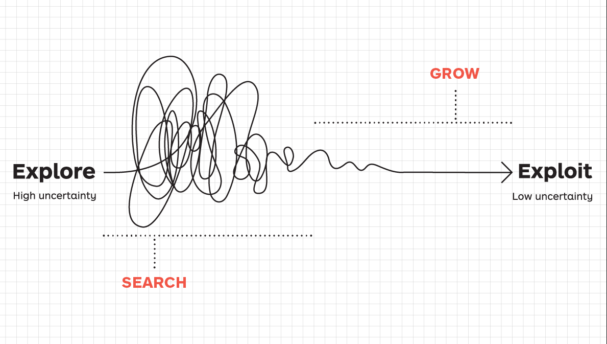
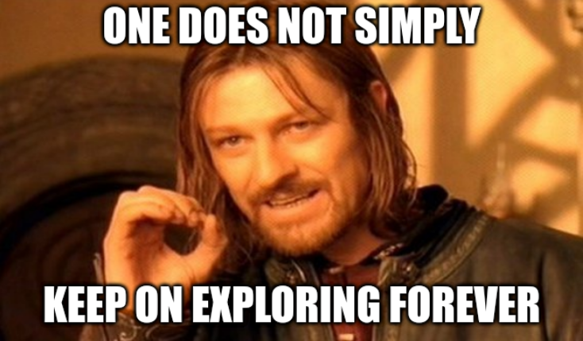

Hi Guys, this is the first of my 3 part series on Reinforcement Learning:

- The exploration vs exploitation Dilemma
- Value and Policy Iteration
- How DeepMind beat the world Go Master

Reinforcement Learning is fucking cool, period. I have been reading about it for quite a time now and thought it would be a great idea to make a blog series, describing some basic RL algorithms and the problems associated with it. It would also serve the purpose of fulfilling my long-standing dream of writing my first technical blog.

Okay, having successfully added enough text to make the preview appear like its a tutorial. For all the AI geeks out there, who thought this was a cool tutorial blog on Reinforcement Learning (RL), my sincerest apologies…..this is not what you are looking for (although seen from a different perspective, maybe it is). But hopefully, the title at least fooled the Medium recommendation algorithms a bit xD.



Having established my identity as a guy lost in vanity, playing dirty tricks like clickbaity titles to increase a few views of his blog ( that almost no one reads anyway) and managing to hurt some sentiments. Let's get started with the real stuff.

So first off what’s the blog actually about, well, loving word-plays and being a self-pronounced master of pointless puns cringe enough to make people laugh in pity, the title was a word-play as well. The blog is not about RL, at least not the RL that’s Reinforcement Learning, it's about something more important and complex and of practical utility than teaching some robot do stuff in a simulator ( which is also damn cool though). It’s about the exploitation vs exploration dilemma that’s omnipresent in **RL ie.** **Real Life.**

### The Dilemma

Surely you have faced this dilemma before, even though you might not know that this is a heavily researched problem in AI. You have two choices in almost anything in life: 1.) you can **exploit** the trusted option that is sure ( or at least highly expected ) to give a good reward or 2.) you can take a leap of faith and **explore** into unchartered territories, either hitting a jackpot and getting rewards beyond your wildest expectations or maybe, hitting rock bottom and failing hard or anything in between.

### Some examples from my own life

The dilemma is such a huge part of our life, that it felt worthwhile to write about it. And what do you know, even while writing this blog, I had the pleasure of facing it again. Which music to listen to while writing the blog? Whether to go with the trusted “Liked Songs” on Spotify ( Exploit ) or explore a new cool genre. Well, after some internal deliberation, exploration it was! Am writing this while listening to some cool French songs ( well, French is said to be the best language for music, and I also loved this youtube called [Pomplamoose](https://www.youtube.com/channel/UCSiPjfAJBgbFlIUsxOWpK0w) which did cool French/English covers, so well, thought why not try it out lol).

Also with today being the last day of the semester, and an entire month of holidays ahead, the dilemma of whether to use the time to explore new stuff and learn new skills, or to exploit my existing skills in AI research and do some more cool work in it strikes again. Thought maybe writing this blog would help me find the answer.

Now with the AI community having discussed this problem in such great detail and being an AI practitioner myself, it felt almost sacrilegious to not derive from the various policies established there, for addressing the problem. So let’s see how those policies transfer to the real world :

### Policy #1 — Always Exploiting

Well, most of us are guilty of living inside that sweet comfy blanket that is our comfort zone. It just feels so safe to go with the option that we know has a reliably high chance of success, whether it's about choosing to climb the corporate ladder or about going to your favourite restaurant for that monthly dinner with the family ( I pretty much order the same dishes every time as well xD ). Especially in India, this policy is deeply ingrained in the minds of children from the starting, with parents forcing their children to choose the tried and time-tested conventional career options.

But as is the case with all greedy policies, the policy often leads to you being stuck at a kind of “local” maxima. What that means is that if you just exploit all the time, repeating the same thing again and again, you’ll never exploit the undiscovered surprises life has kept hidden for you. It’s the equivalent of being trapped in the proverbial “Rat Race” ( which reminds me, you should totally check out this awesome book called Rich Dad Poor Dad, you’ll never be the same about the importance of learning personal finance again )

### Policy #2— Always Exploring



Now rarely anyone follows this policy, but this extreme end of the spectrum is also worth contemplating about. What will happen if you always explore new things. Well as an initial thought, you might be tempted to say that life would be amazing, you’ll feel alive and stuff, because, in the recent world scenario, everyone tells you to explore new horizons, but might be wrong with that?

Well first of all if you just keep on shifting from one thing to another, you might end up having knowledge about nothing. To get good at something, you have to put in the time and repeat it again and again ( exploit it ). Have literally spent months in this quarantine period, mindlessly exploring stuff and while it was super fun to learn all these new things, now that I think about it, didn’t really get a solid understanding in any of them to do anything meaningful about it. Although yeah, one thing is true as hell, you NEVER regret spending time exploring new stuff. Also well, exploring always might end up you hitting rock bottom, as it did quite literally for our dumbass Dora the explorer in the above gif xD

### Policy #3— Epsilon Greedy



This is the defacto strategy in the AI community, which is simplistic but turns out to be surprisingly hard to beat. What it says is that you keep on sticking to your tried and tested options for most of the time, but, time and again you randomly explore some crazy stuff. This will make sure that you keep on leading a smooth life ( due to the exploitation ) but are also able to discover new aspects of yourself through the occasional exploration.

I think this is the optimal policy for your life as well, keeping some kind of mechanisms, which you know would keep your life stable and then occasionally just exploring random shit to reinvent yourself. It promotes the idea of being a life long learner, who has some kind of a main job which supports for his/her family, but also has these tangential side interests which keep the exploring child inside him alive :P

### Policy #4— Decreasing Epsilon Greedy

While the epsilon greedy policy is the most optimal one in regards to life, this is the policy that most people actually end up following. In this policy, you gradually stop decreasing the amount of exploration you do over time and do more and more exploitation. This is similar to humans, who in their childhood are brave explorers, but over time, as adults become more and more conservative in nature.

And while this policy was introduced in the AI community to allow for allowing the agent to gradually end up having a smooth transition into its end state ( which is death in the case of humans). I strongly feel that no matter how old we get, no matter if we are still in college or an industry veteran, we shouldn’t stop exploring, because you never know what new interesting things might have popped in this awesome wilderness called the Earth.

### Policy #5 —Contextual Epsilon Greedy

This is the fight or flight version of exploration strategies for your life. The rule is simple, when your life is going smoothly, explore more and when you are having a hard time, exploit more and get yourself back on track. If you have an exam tomorrow, study for it, don’t start on exploring and start learning that new song ( speaking from personal experience lol ). If its the start of the semester, and life’s going on smoothly, take risks, explore new stuff.

Now usually it's the opposite that happens, people explore less when their life is going on smoothly, they like living in the comfort zone and when life gives them a sudden shock, tragedy strikes, then they explore a wide variety of techniques to mitigate and get back on track. But just think about, what if doing the opposite makes more sense?

Having mentioned all these policies, its important to remember that there is no one glove fit alls policy for life, and well life’s a pretty complex thing, even for something relatively easier like Reinforcement learning, the exploration vs exploitation dilemma is pretty much unsolved. Regardless it’s an interesting problem to confound upon and it also goes on to show that we can take inspiration from science to solve real-life problems ( and the other way around ). The dilemma is close to my heart, both because I love Reinforcement Learning and AI in general and also because I find myself in the same dilemma almost every day, especially in the COVID times due to the extra free time.

Anyway, that’s all for the blog post folks, as always it would be a pleasure to get any kind of feedback for my blogs. And if we are acquaintances, and haven’t talked in a while, let's each explore a bit and connect again! Until then, so long ….



**References:**

[1] <https://medium.com/@dennybritz/exploration-vs-exploitation-f46af4cf62fe>

[2] <https://medium.com/data-science-for-everyone/the-explore-exploit-dilemma-436cb1edff0d>

---

*Originally published on [Medium](https://medium.com/@ayushtues/the-exploration-vs-exploitation-dilemma-in-rl-fca0811142ec).*
