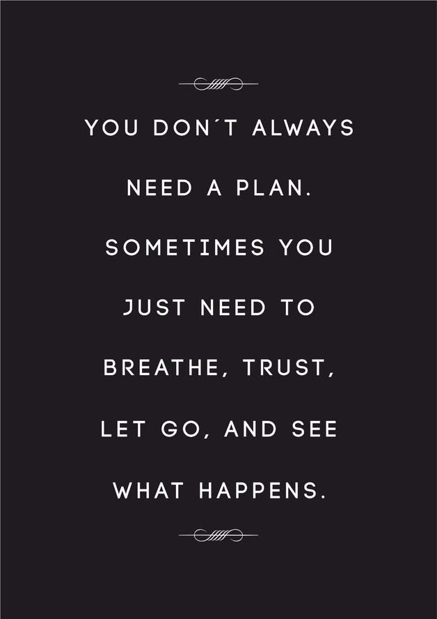
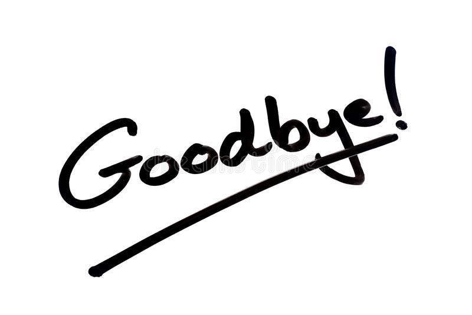

What’s your plan? You’re entering your final year, what are you planning to do after college, you must have thought about it by now, right?

Well….*HEEEELLLLLLL no* 🙈



I don’t know why, but people always seem to assume that I have always got my stuff figured out. This is something that has stuck with me since my school days, and it probably seems that way from the outside, when you *just* see the outputs and the achievements and stuff while the reality can’t be farther from the truth, and the peeps who really know me, know just how childish fickle-minded, volatile, gut-feely guy I am, taking most of my major decisions just because my instincts tell me so, and also how I am *totally* not smart enough, or focused enough to make any long terms plan anyway.

> Tera to sab set hai, tujhe kya hi chinta hai”

> *- I HATE these words*

Anyway, enough with the rant, let’s talk come back to the blog. Well, I don’t really have a plan about what to write in the blog, I have observed that most of my good blogs happen without prior planning. It’s like I can spend a day thinking about what to write in the next blog, and it’s all blank, but then bam, days later, when I am not even thinking about it, the idea for the next one strikes, and I usually end up writing them within an hour or two. Incidentally, this also happens a lot with the books I read, I spend a lot of time searching for the next book to read, try out reading some pages of a few of them, get bored, tired or both, and end the search for the day, and then miraculously when I am not looking for a book, I get a book suggestion somewhere, and it turns out to be so lovely that I end up binging that book in the next day or two.

Why does everyone expect us to have a plan? Yeah, I am sure all of your plans for 2020 turned out well 😛 . When the world is soooooooooo random, what’s the use of planning anything anyway. Also, why do we suddenly need to have a plan when we grow up, as a child I could literally spend the entire day doing *nothing*, having to plan out *nothing*, and expect *nothing* out of life. Hell, I am always amazed how you suddenly need to have a plan, when you move from 9th to 10th, or enter your final year…..and nobody expects anything from you in your 9th grade or junior year, but no, the transition happens, you advance a grade/year, and suddenly everyone expects you to have a plan, even though you are literally the same person you were a few months back, still as clueless, or maybe even more 🙈



I have entered my final year at college, and I have no clue what to do with my life. Somedays I want to be an AI researcher, others an entrepreneur, somedays I want to maybe do an MBA and yet another day I just want a comfy job, some days back I was interested in robotics, computer graphics, finance, psychology, graphic designing and there was a time when I was absolutely sure I wanted to work on making a self-driving car, and oh currently I have got this newfound fascination with the whole blockchain-crypto finance world which absolutely doesn’t fit into *any* of my possible future plans, but I still ended up spending a lot of time the last month digging into it. TLDR, I DONT HAVE A PLAN

And here’s the catch, I don't think I *need* a plan. I might just want to let things roll out on their own, and just try to have fun along the way, doing whatever the hell I want to do, and accepting wherever that leads me to. Cause I am just a kid right now, I just can’t dictate my life following some kind of “plan” to achieve some kind of stability that somehow society wants you to achieve after college. Sure some of my friends have a plan and are very focused about it, make dedicated efforts to achieve that, and I am sure having a plan would help them a lot to achieve whatever they want, and I often get anxious seeing them having it all figured out, ahem, maybe they also don’t have shit figured out, and it just appears so, but at least they say they are sure they want to do a PhD or something, would give anything for even that little bit of clarity 🙈. But okay, I have turned out just fine till now, allowing fate to take the reins for me, and I’ll probably end up fine now as well….

Anyway, this turned out more to be a therapeutical rant kind of thingy to calm down my final year entering self, rather than some kind of blog, which is totally fine, cause after all, what’s wrong about being “the man without a plan”.

That’s all for this piece I guess, if someone even reads this stuff anymore, feel free to ping me up, let's catch up, surely we’ll both have a lot to talk about in this mad year 😛

Until the next one, Stay Safe!

---

*Originally published on [Medium](https://medium.com/@ayushtues/the-man-with-out-a-plan-1791e03be39a).*
