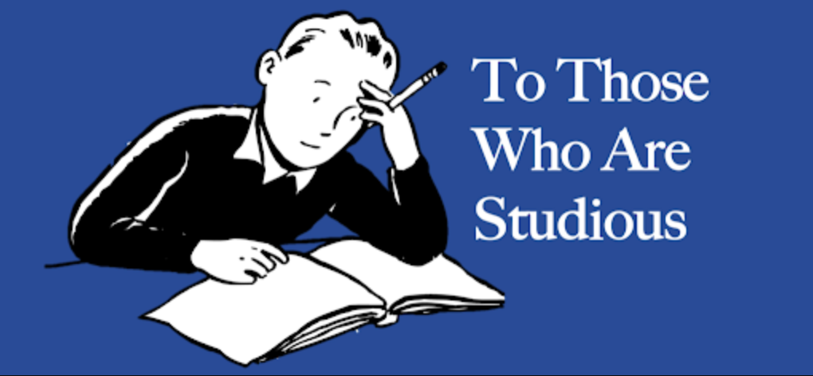
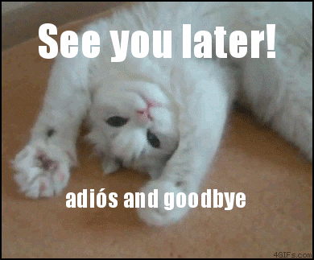

Let's take a trip down memory lane. Not really that deep though, not till the beginning of the universe or the big bang, just a bit deep. Back to the good old rose coloured school days (ahem, actually I am still a student so it’s not much of a trip for me :P). It was super fun, right? Each day being a new adventure, without any worry in the world. Also for most of the students, the school wasn’t really a place to study, it was more of a hangout place, an elaborate cafe so as to say. Heck, you can almost say that it was a library-themed cafe, where you were surrounded by books and had to socialize in hushed voices due to the metaphorical librarian, ie. the teacher and pay a hefty price for the experience like you know, cafes (why the hell are cafes so overpriced).



But even then, there was always that one guy, that poor soul, who took things waaaaaaaay too seriously. His entire world revolved around books and grades and assignments and the only thing he dreaded more than death was getting a fail grade ( and well….maybe public speaking?). Also, however, embarrassing that might be to accept…..I was one of those guys and some would argue that I still am.

But wait! this post is not about me. Well, it’s partially based on my own experience, but that’s just a way to represent people like me who are extremely studious. Take it as an estimation of the entire class of studious people by one point sample viz-a-viz me, although since it’s a single sample estimate, it’ll be a bit biased ( I kind of love probability and statistics, so umm, apologies for the lame jargons and analogies).



Honestly speaking, being studios has its perks, I’ll have to admit that. But now, in my sophomore-junior-ish year at college (it's kind of in an indeterminate position currently, due to COVID), a few years out of school, looking back, I kind of regret being studious. It lead to me thinking about the ways it has affected my life ( and other things in general) and while it has lead to many, many good things, mostly in my professional career, but it did have a lot of side effects (There really is no free lunch, is there?). This lead to me, writing this blog post, reflecting on what I think, are the side-effects of being studious. Let’s begin:

#### You tend to become a perfectionist



When you spend your entire childhood in getting “perfect A’s”, you can’t help but develop into a perfectionist. It’s just never enough for you. You always try to find out loopholes in your existing work, be it your preparation for the next exam (or a piece of blog you are working upon :P) and while perfectionism is not necessarily a bad thing, it can lead to a very subtle kind of procrastination where you keep on delaying things, on the prospect on being “not yet just right”. It becomes very hard for people like me, to realise it, let alone fix such procrastination since it gives a false sense of superiority.

#### You tend to leave school with very few memories



This is probably the single biggest regret of my school life. After 4 years, I barely have any good memories of my school life. It’s almost like I never even went there which apart from being a bit spooky is really really sad ( I should get my memory checked up, maybe it’s an artificially induced amnesia to delete the memories of some super-secret alien species I discovered in the school. I always suspected some of my teachers are aliens :P). People like me tend to be so focused on their academics, that we forget to enjoy the simple things in life. I can probably give an almost exact description of how my daily day at school went, and that would describe each day of my school life, owing to the monotonicity. We also make very little friends, due to being framed as the “nerds” which reduces the chances to develop meaningful memories with friends even further.

#### People tend to ignore other parts of your personality



Most of my conversations with old schoolmates start with them making direct/indirect references about how studios I was. It’s like the only image people remember is that we were studios. And well that hurts a bit. Especially when you are now in college and are highly embarrassed by being called studious ( Peer pressure in colleges often makes us ridicules our past-studious habits, though, I now feel that we should continue enjoying our studies if we really love doing so). Heck, even boring studious guys like us have some other interests and we would like for you to remember them and talk about them for once. But alas! they all tend to be overshadowed by the single trait of being a studious nerd. Maybe we are at fault too, we tend to be so overindulged in our academics at school that we forget to talk to other people about stuff that interests us other than books.

#### You tend to be weird at social events



Studious people tend to lack apt social skills. Maybe it has something to do with most of us being likely to be introverts. Heck, I am writing this blog due to being bored as hell at a wedding, away from all the bands and the ruckus. Still, it’s not that we are not interested, we just find it hard to do the small talk, maybe because we have so much to remember from out studies that we like to cut short to the chase and talk/remember only important stuff. But it’s a bit weird, being well-read in a variety of topics, we tend to be more informed about many things than most people and should be able to carry out interesting conversations. But well, I guess social dynamics are something that just can’t be taught.

#### You tend to be weird around the opposite sex

[(GIF)](https://tenor.com/embed/4888416)

*Does anyone else relate with Chandler?*

Have you seen the meme that many girls have a crush on the school topper? Let me tell you, its just a meme, a thing to be laughed at, cause the reality is just the opposite. A side effect of being studios is lack of interaction with the opposite gender, with the deficit compounding over your school life, leaving you incapable of even the simplest interaction in the end. The only interaction we usually have with the opposite sex in school is in the form of solving the study related doubts ( and well if you are a no-fucks-given jerk like me, even that probability rules out, leading you totally unaware of the unsaid norms of talking with the opposite gender).

#### You tend to like music

*Ah! The feels 😛*

Attribute it to some weird scientific correlation between liking classical music and IQ, or to just the need to cut off the noise while studying, I have personally observed that studious people tend to love music. Well, the type of music doesn’t have to classical though, I myself love rock, pop, rap, R&B and a bit of classical (I am listening to Highway to hell by AC/DC at the time of writing this line). Maybe the reason behind it is that it helps us focus and think clearly and gather our thoughts. I also feel that I can remember things better while listening to music, although listening to too much music can sometimes be detrimental also, causing an inability to think properly in its absence ( it also becomes the reason of constant scolding from your parents, due to listening super loud music in your headphones :P)

Well, whether I like it or not, being studious has been a dominant part of my personality and has had a major impact on my life ( and I guess of many other people like me). And although I am becoming increasingly less studious ( mostly to avoid being ridiculed as the “nerdy geek”), often I have a thought that I should be true to myself and should enjoy studying, since I really love doing that and gathering knowledge about new things. Maybe someday I’ll acknowledge this “studious” part of myself as something to be proud of, instead of trying to hide it and maybe then I’ll recognise the above-listed facts as a part of my personality and come to peace with them. Until then :

---

*Originally published on [Medium](https://medium.com/@ayushtues/the-side-effects-of-being-studious-a09fa3ad64e4).*
