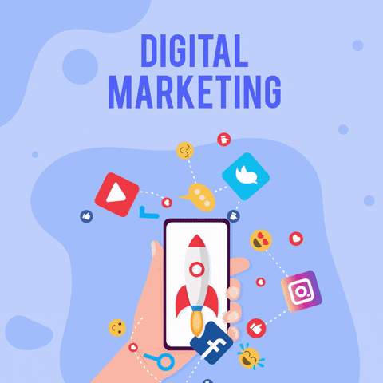

Just another “normal” morning, slept late last night watching shit content on Facebook and stalking people or looking at old comments on my posts. I put on my glasses, and everything is still fuzzy in my mind. But wait, something’s wrong; something’s missing, it feels like my hands are restless to grab something, oh yeah, my mobile….even though I promised myself that I wouldn’t use my mobile within an hour of waking up. I fail and spend about half an hour checking the seemingly endless amount of notifications that accumulated through the night. Indeed, the guilt due to failing at a personal commitment is just the feeling you want to begin your day with?



Well, this guilt trip continued to happen on countless mornings, and it made me consider my relationship with social media critically. The honeymoon period of wonder and high levels of dopamine was now over, and it was finally time to put it under a critical lens, to decide if the relationship was becoming toxic. Well, indeed it was! Realising this, led to a metaphorical break up with social media and maybe that lead to this post as a rebound?

Anyway, before starting this all-out, highly biased rant on social media, let me first explain a bit about my relationship with social media. I won’t go through the details of my social media journey, but for a little perspective, I “officially” came into the world of social media about two years back, fresh out of a self-imposed social isolation of about two years due to my JEE preparation (a highly competitive engineering entrance exam in India) and its suffice to say, from then it hasn’t been anything less of a love-hate relationship, with multiple highs and lows, with me acting like a typical tsundere, both actively criticizing social media and loving it. I have gone from using Facebook the entire day, laughing off memes, chatting with people I didn’t even know well on messenger ( which in hindsight, didn’t result in creating any meaningful connections except a rare few) to running a computer script to unfollow everyone (to make my newsfeed blank) to recently manually unfriending everyone of my 500+ friends and deactivating Facebook forever for good (yep, that was a pain in the ass, performing the same operation 500+ times). Now I just limit myself to WhatsApp, Slack, Hangouts and LinkedIn. Well I know it’s a still a bit hypocritical of me to write this blog, being still a moderate user of social media, but well, whatever.



Having experienced the complete cycle of social media usage, I realise that just like all things in the world, it is neither black nor white, its more of a grey slippery slope, where its easy to tumble into the black pit if you are not careful and comparatively difficult to reach the white light at the top. Given that its a complex entity, I first thought about writing something that agrees with the popular opinion of the effects of social media, by researching about it on blogs and watching some TED Talks, but I think that it would be better if I just gave my personal opinions without any external influence, because well, an honest personal opinion is rarer and rarer to find in the current social world. Also though I *have* watched a lot of TED talks on this topic in the past, it's around 2 AM in the night when I am writing this and at this time, the things that come in you are what you really think, you can’t lie well even if you tried to :P

So anyway, I’ll try to explore both the positives and negatives aspects of social media I experienced as well I can, although I’ll admit, being a bit bitter from the metaphorical breakup, I’ll be a bit ( read: highly) biased on the negative aspects:

### Positives



#### Acts as a (Temporary) Mood Booster

A lot of people, including me use social media as an escape from the real world. The “virtual world” of social media is like a lucid dream, you can control what you see, who you talk to, the world is customised to only show you what you like and it gets better and better at it. It allows you to escape from whatever shit is going on in your real life and indulge in a dream world, obviously boosting your mood. But well, remember, it’s just a dream, you gotta wake up sometime :P

#### Keeps you updated about stuff happening

Okay, I’ll have to admit this, I started missing out on some important things ( but also on a lot of things that I shouldn’t care about) once I stopped actively using social media. Everyone you know is on social media, hyper-sharing what’s happening around them, what’s cool nowadays, which meme is the most popular right now ( my meme knowledge took a serious hit after quitting Facebook :P) Being an active social media user helps you keep yourself in the loop. You know what your friends are up to and it prevents from the awkward moment when you are the only one who doesn’t know something in a conversation, which is supposedly common knowledge in the social world. Social media is also a great place to get updated on the news, with various news-agencies, political leaders, businessman posting frequent updates about what’s happening in real-time, in a relatively less censored fashion than popular media.

#### Great platform for Personal Branding/ Digital Marketing

Personal Branding is important. People like political leaders, actors, entrepreneurs have huge PR teams trying to maintain a consistent social brand of themselves. After all, in this day and age, you are a BRAND!, you need to sell an image of yourself that people approve of and social media is the perfect platform to do so ( although, this creates a sense of alienation from your real self if your social brand is different in value from what you really are). There is also the entire field of Digital marketing, where businesses advertise their products and services through social media ( heck this is how social media websites earn money, by displaying targeted ads to you after auctioning the ad-place amongst various companies).

#### Great platform for organising Online Funding/Donation events, Petitions etc.

Well love it or hate it, you gotta give social media this one. There are many instances where collective funding on social media platforms allowed to provide funds to people in dire need for medical funds/donations. ( And I am not talking about the “zombie” money laundering scheme introduced in Breaking Bad..though that was cool :P). Also, social media is a great level playing field. Everyone’s is free to voice their opinions and get it noticed, and when a huge amount of people collectively align on a particular viewpoint against social malpractice, they can use the power virality gives them to voice their collective opinion as an online petition, which does get recognised by the authorities some times.

#### Gives a (Fake) Sense of Belonging



We all seek social approval. It's rooted deep in our nature due to evolutionary reason. All of us strive for a “sense of belonging”, the feeling that you are connected with people, people who care about you. Social media gives you just that. Doesn’t it feel good when you share something, and people like it on social media? You get instant gratification. You feel that you are connected to your followers/friends, thus satisfying the ever-longing need for belonging. And well, in most cases, it’s good to connect with people you lost contact with due to some reason or the other, but it's also important to realise that at its core this is not a solution, the only way to fill that deep hole of loneliness is to make actually meaningful connections with “real” people.

### Negatives



#### It lowers your self-esteem

Has it ever happened to you, that you opened a social media website and saw people sharing about the new high paying job they got, the perks associated with it, or how they have the most awesome partner, which instantly put you into an existential crisis of what you are doing with your life? Well, I most certainly have experienced that. This is probably one of the major reasons why I quit social media. (I vaguely remember seeing one such post just waking up, and that made me feel depressed for the entire day). Social media only displays the “highlights” of people’s life. People only post the good things that happen in their life, projecting a false image of success. You don’t get to see the real shit that’s happening in their life, the struggle behind the success, the fights in the relationships, you only start comparing your life with the “high points” of other’s lives, leading to increasingly lower self-esteem.

#### The Dopamine Addiction aka “The Twitch”

Everything we do is largely controlled by the feel-good chemical called Dopamine. Heck its also basically how drugs work, by inducing the brain to release huge amounts of dopamine, leading to a “kick”. Social media can ve called a “drug” in a similar fashion, you get a small dopamine kick every time someone likes something you shared, or you get a new notification. Researchers call this “The Twitch”. You get so addicted to the small amounts of dopamine the instant gratification from social media provides you that your brain almost subconsciously “twitches” to engage further in social media to get another kick. Just like drug dealers exploit people, the people behind social media carefully design their apps to get you addicted to it. When you start using it, you get huge amounts of dopamine from it, leading to huge kicks, but soon, being accustomed to these new levels of dopamine, your brain demands an even higher level of dopamine’s to stimulate itself to get the kick, this pushes you to engage even vigorously, trapping you into the voracious trap of dopamine addiction. ( There’s an awesome book called “*Hooked: How to Build Habit-Forming Products*” if you want to explore how such products are designed).

#### It tends to reduce focus and wastes productivity



It’s said that the average attention span of a person has reduced to around 5 mins. This means that you can’t focus on a particular thing more than 5 mins, and I believe social media is a major culprit behind this. There is just so much content there, that you keep on switching from one video to another, one meme to another, losing the ability to appreciate simple things. I myself struggle a lot focusing on complex stuff, due to being accustomed to processing information in easy to understand tidbits as is the way on social media ( With tweets being restricted to 140 words or less). Apart from decreasing focus, social media also eats away huge amounts of productive time, you don’t realise when an hour passes by whilst scrolling through Instagram videos or memes. You don’t realise just how much time it's wasting away, once I started reducing my social media consumption, I instantly got more time to work upon some actually productive things, like say writing this blog :P

#### It’s full of shit content that makes people stupid.

Have you ever watched videos of people reacting to, people reacting to, people reacting to something? I mean there’s something seriously wrong about the quality of content that we are wasting our time on social media. People create derogatory videos full of casual sexism, body shaming and profanity just cause these things tend to get more views from users. If you are gonna waste your time, consuming content, then at least watch some decent content. Take memes, for example, they are not even funny most of the times, if not offending. And don’t get me started on TikTok videos. Now I know you must be thinking that these are highly creative and shouldn’t be disregarded as stupid, and well you are entitled to your opinion, but personally, I have never got goosebumps watching any meme or TikTok video, but I did get goosebumps listening to “No time to Die” or watching masterfully directed scenes from Breaking Bad. I personally think that if you are consuming content, then it should be something that makes you think, make you challenge your perspectives and inspires you to do something great.

#### Promotes a fake sense of beauty and is full of hate comments/trolls promoting body shaming, sexism



Everyone looks so pretty on social media, people spend hours trying to get that perfect selfie. This intensifies the need for people, especially women to be over-conscious about their appearances developing deep insecurities among them, while in reality most of the people don’t really care about how you look as long as you have a decent personality ( though that doesn’t mean you don’t need to groom yourself). Also, it's full of some A-holes whose only reason for existence is to troll people or spread hate. Its weird, and bit hypocritical when people body shame women on Instagram. I mean its a follower based app, you yourself follow the person to view their photos ( and indeed most of the guys use Insta only for this purpose) and then you yourself body shame the person for their pictures. I mean if you don’t like it, then just unfollow them, they are not asking you to see it.

#### Makes it very easy to influence people

You might have heard about the Cambridge Analytica scandal, which uncovered the adverse extent to which people are influenced by propaganda on social media, which can have huge effects like affecting the presidential results in the US heck, I guess even the Indian general elections were highly influenced by social media (btw there’s a great movie on Netflix called “The Great Hack” on the Cambridge Analytica Scandal). It’s almost scary how much these apps know about us and even scarier that they use this data to subconsciously influence our decisions using targetted ads. Your entire personality is reduced to some numbers, and numbers can be manipulated :P

Well, like it or not, Social media *has* become an inseparable part of our life, and its really hard if not honestly impossible to separate ourselves from it. But still, it's my belief that just like everything, having an idea about how it affects us and its pros and cons can help us improve our relationship with it. I personally feel that I now use social media in a much healthier fashion than before and that is also reflected both in my mental state and personal/professional life. I hope this article at least made you a bit more critical of social media and may improve your own love-hate relationship with it a bit :P

So, Well until the next post —



---

*Originally published on [Medium](https://medium.com/@ayushtues/what-i-learnt-from-my-love-hate-relationship-with-social-media-1d863639303f).*
