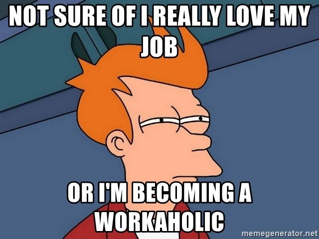
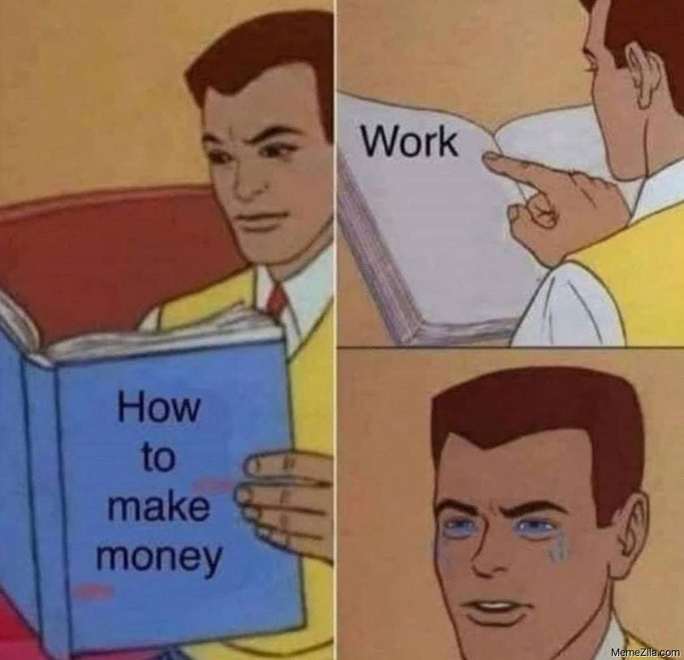
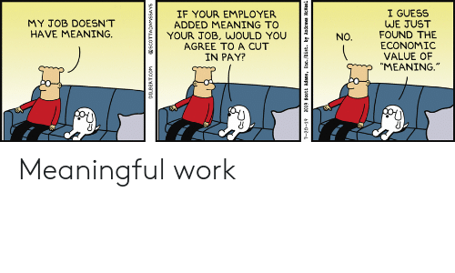
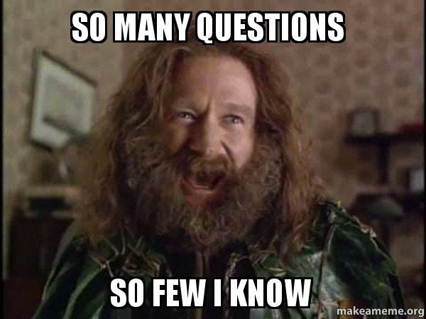
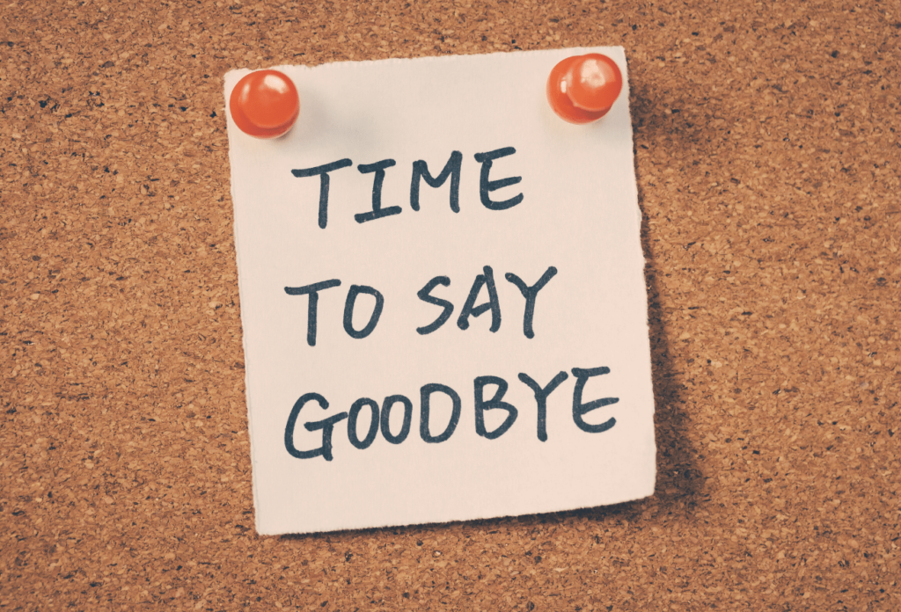

Na na before you get any funny ideas, this wasn’t inspired by Rihanna or Fifth Harmony. Instead this is the result of having zero motivation to do any work ( and not having any work to either lol ), and the gradually increasing guilt that comes from not having written anything for a while.

Anyway, while watching random videos on YouTube ( [link1](https://www.youtube.com/watch?v=RPjL909DiVI), [link2](https://www.youtube.com/watch?v=cZnBNuqqz5g) if you’re interested in what I was watching)and diving deeper and deeper to the rabbit hole it is, I started thinking about a question : ***Why do we work?*** Don’t ask me why I was thinking about philosophical questions while watching shit content on youtube, the internet is an abyss, stare deep into it, and it stares back at you and messes with your head.



Well the answer to “why *we* work” is not for me to answer, that’s something for the world and all its people to decide, so I’ll try a different version of the question, sort of like a single sample estimate of the problem : why do *I* work?

Since I am in my 4th year now, and will start “working” in whatever sense the world defines it in the near future, this question was a bit hard for me to think about. But the question is more general than just the work I’ll do for a company, work encompasses a large part of my current life as well, as a self-proclaimed workaholic, the work I do is what defines me for me. If there is no meaning to why I do work, then is there even a meaning to me? Well about that, there is no meaning to my or anyone’s existence lol, but let’s not go there today.

Why do I work for? The first obvious thing that comes to my mind is money. I work so that I can potentially financially support myself in life. And this is probably why most people work, to support for themselves and their family, and I don’t want to demean this, it’s a noble task to work to support for those you care about and also for yourself, to live whatever standard of lifestyle you wish for. But is money all that I work for? Not really.

If money was all I worked for, it wouldn’t explain the hours I have spend reading about stuff which has no connection with my job, or for the times when I worked for free, working just for the sake of it, working purely out of intellectual curiosity, and atleast till now, I have worked harder here than when I worked when anyone paid me for the task. So maybe I work, just because I like working? But I like a lot of other things as well, then why work if I can do those other things, if I am not getting any special reward to do the work, then it’s just another one of the things I can possibly do, like doing nothing, I love that as well xD. So maybe that’s why we give people money to work, so that they choose it over other things they equally enjoy?

There’s also the concept of a 5day, (or a 4day) workweek, which I don’t seem to get. Does that mean that work is not a necessity in your life, but just a part-time affair? Why do we need a break from work, if work is such an integral part of our life, why does even the bible say we need a day off?

> Exodus 34:21: Six days thou shalt work, but on the seventh day thou shalt rest: in earing time and in harvest thou shalt rest

Would we not need a day off, if we were not working for money? Think about all the extra work we’ll get done off, Would that extra day of work be a good thing for society, or would that be a bane?

Or do we work just to give meaning to our life? Maybe we work just to give an excuse for why we are alive on this earth, cause hey, I am working, that means I am doing something meaningful and thus I deserve to live? Or maybe that’s just the workaholic inside me trying to justify its existence lol, Or maybe we work just to distract ourself from the problems in our life? If we can appear to be busy in our “work”, we don’t need to focus on other things in our life which we don’t want to encounter head on.

Alas, I don’t know the answer to the question of Why do we work? and it seems like I posted a lot more questions than answering anything lol, but hey, that’s what the blog is for, to dump in whatever shit’s going in my brain and get some clarity ( or get even more confused ). Anyway, the reality is that I will have to work in one form or another for the rest of my life, even if there is no meaning to it, cause who said even life has any meaning at all?

Well anyway, that’s it for this blog, it’s funny how I can waste time thinking about stuff to write about, and then get an idea while watching random videos on YouTube….maybe there’s something seriously wrong with me, but okay, until the next time!

---

*Originally published on [Medium](https://medium.com/@ayushtues/work-work-work-work-work-why-21e458df68bc).*
